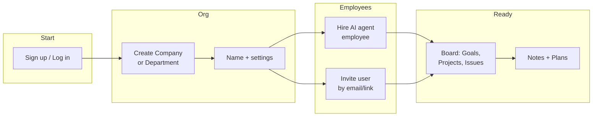
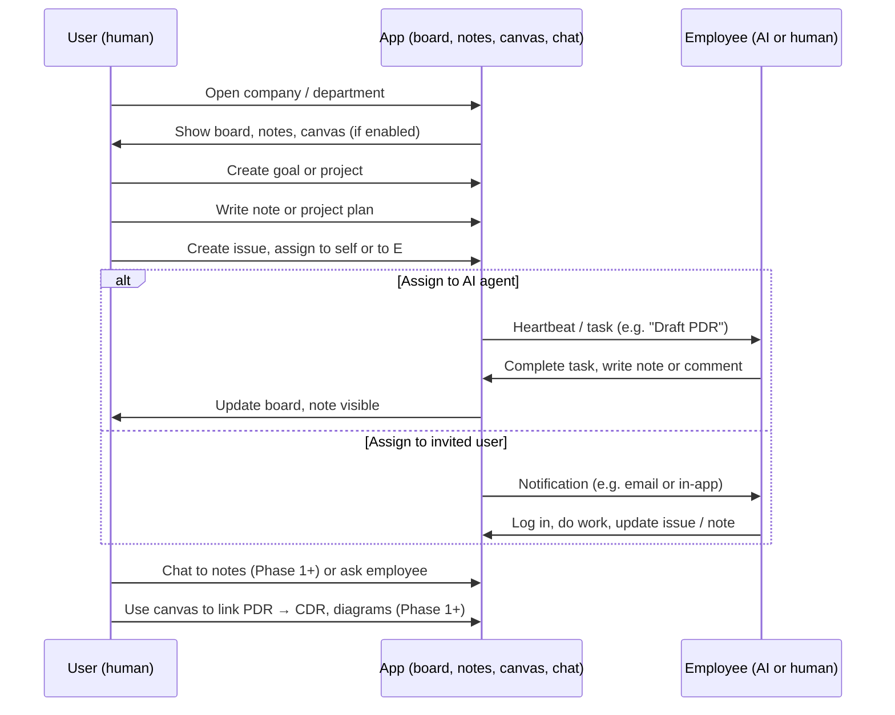
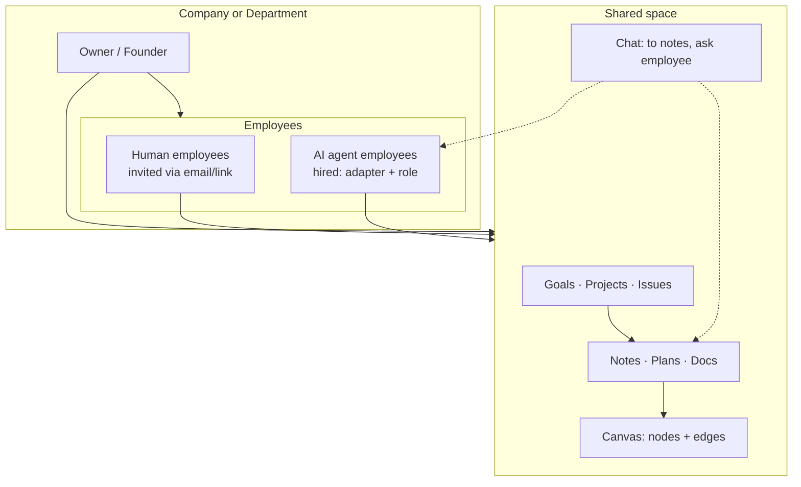
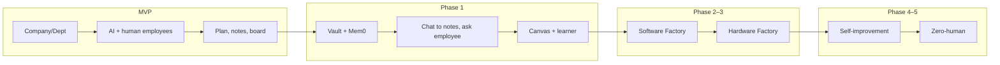
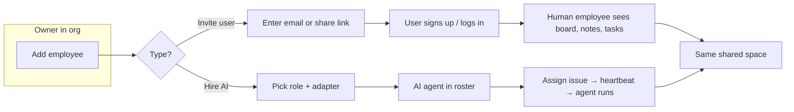

# Master Plan: Self-Building Application Factory

**North star:** Build an application that helps build applications — with less and less human intervention until **zero human in the loop** for execution, iteration, and institutional memory.

**App model:** The app starts as a **company** or a **department**. Each can **hire AI agent employees** or **invite real users** as employees. Everyone (humans and agents) uses the same space for **planning, writing notes, building plans** (goals, projects, issues, docs), and later Design Factories. MVP gets users and agents doing this from day one.

**References:** [plan.md](plan.md) (AutoResearch stack) · [designfactory.md](designfactory.md) (Hardware/Software Factory) · Self-Learning AI App plan (Paperclip + Autoresearch + Arscontexta)

---

## Execution: phase docs (build and execute)

| Doc | Purpose |
|-----|--------|
| **[phase-0.md](phase-0.md)** | **Do first:** Express → NestJS conversion (study, skeleton, port routes/services, auth, heartbeat/realtime, testing). NestJS skills ready to support. |
| **[mvp.md](mvp.md)** | After Phase 0: MVP on Nest — company/department, employees (AI + human), board (goals/projects/issues), notes/plans, optional **per-document** prose vs **simple canvas**. |
| **[phase-1.md](phase-1.md)** | Memory, chat, canvas, learner (Vault + Mem0, chat to notes, ask employee, **Hypopedia-class infinite canvas** on canvas documents). |
| **[phase-2.md](phase-2.md)** | Software Design Factory (Refinery → Foundry → Planner → Validator). |
| **[phase-3.md](phase-3.md)** | Hardware Design Factory (same flow for mechanical/PCB). |
| **[phase-4.md](phase-4.md)** | Self-improvement (learner → vault, dual-loop prompt evolution). **DONE.** |
| **[phase-5.md](phase-5.md)** | Zero-human runway (CEO/Research Director, founder monitor only). Runs alongside Phase 6. |
| **[phase-6.md](phase-6.md)** | Chat-native knowledge: chat-as-editor, wikilink graph, 6R loop, pattern extraction, budget/audit. |
| **[hypowork-documents-scale-and-graph.md](hypowork-documents-scale-and-graph.md)** | **Implementation:** hypowork company docs — autosave scale (S1–S3), `[[wikilink]]` / `@` graph (DG), link neighborhood for **Mem0 + Vault** context (AM); ties Phase 1 memory/chat. |
| **[testreport.md](testreport.md)** | **Manual verification:** copy-paste checks per phase (MVP → Phase 6); **update when a phase is completed.** |

### Execution / shipping sequence (optional track)

Phase **numbers** stay stable; **delivery order** can differ from numeric order when documented. For a **software-first** product, a defensible default is **0 → MVP → 1 → 2 → 4 → (5 + 6 in parallel)** (software-scoped Design Factory, autonomy, then chat-native knowledge). **Phase 3** (Hardware Design Factory) runs in parallel or after the first software + autonomy slice. Phase 4 is done; Phase 5+6 run together — agents use Phase 6's chat-as-editor interface as the knowledge layer. Hardware-specific autonomy bullets stay **deferred** until the hardware factory lands.

---

## Engines: modular, in-app, independently developable

**Arscontexta, Mem0 (and more later)** are treated as **engines** — modules built **into** the app, not separate services that the app calls over the network. Benefits:

- **Develop and improve independently:** Each engine has a clear interface; you can swap implementations or upgrade one without rewriting the rest of the app.
- **Scalable without much breaking:** New engines (e.g. search, graph, another memory backend) can be added as new modules; existing features depend on the interface, not the implementation.
- **Fewer moving parts:** No “run Arscontexta-grok as a separate app and call its API” — the app owns the capability; optional compatibility layer for external vaults later if needed.

**Initial engines:**

| Engine | Purpose | In-app shape |
|--------|---------|--------------|
| **Vault (Arscontexta-style)** | Shared long-term knowledge: claims, skills, 6R-logs, MOCs, structured markdown. | Module inside Paperclip app: learn from Arscontexta-grok, implement vault + 6R pipeline in-app (see 1.3). |
| **Mem0 (runtime memory)** | Per-agent/session fast recall; vector + graph; auto fact extraction, semantic retrieval. | Module inside app (or MCP with clear boundary): runtime memory for agents. |
| *More later* | e.g. search, graph, specialized stores | Same pattern: add as module with defined API; app composes engines. |

The app (Paperclip) **composes** these engines. Agents and Note Viewer use both: Mem0 for quick recall during a run; Vault for durable, shared institutional memory. No “choose A or B” — **use both for different purposes**.

**Company documents (hypowork):** Explicit **outlinks/inlinks** (Obsidian-style `[[wikilink]]` and `@` doc references) support **link-neighborhood** retrieval: when chat or an agent is scoped to a note, context can include that doc plus **1-hop linked** company docs before broad Vault/Mem0 search. See [hypowork-documents-scale-and-graph.md](hypowork-documents-scale-and-graph.md) and [phase-1.md](phase-1.md) §1.3 / §1.6.

---

## Vision Summary

| Phase | Goal | Human role |
|-------|------|------------|
| **MVP** | Use from day one: company/department, hire AI or invite users, plan + notes + plans | Everyone (founder, invited users, agents) collaborates |
| **1** | Full memory + chat + canvas + learner agents | You set vision; agents execute; chat to notes, ask employees |
| **2** | Software Design Factory: Refinery → Foundry → Planner → Validator for code | You or agent runs flow; plan/design/diagram/notes |
| **3** | Hardware Design Factory: same flow for mechanical/PCB (Onshape, KiCad, BOM) | You or agent runs flow |
| **4** | Self-improvement: learner agents improve skills/config; outcomes → vault | You approve budgets; agents improve system |
| **5** | Zero-human runway: CEO/Research Director + pods run with minimal founder touch | You monitor (Note Viewer + Chat); system self-builds |

### Virtual company — how this roadmap maps (and common gaps)

**End state:** A **virtual company** where **humans and agents** share **project management** (goals, projects, issues), **author company documents** (policies, SOPs, plans — see [phase-1.md](phase-1.md) §1.8), then **design work**: **software** in Phase 2 and **mechanical + PCB** (e.g. Onshape, KiCad, BOM) in Phase 3 — each initiative uses a per-project **Design Factory** tab (same label for software and hardware) with **Refinery → Foundry → Planner → Validator**; **board Issues** and **Planner work orders** stay distinct, with an optional link when work must appear on the board. Factories use **versioned artifacts, tools, and agents**; software is **code-backed**; hardware adds CAD/schematic/BOM with the same “artifact + API + runner agent” pattern, not a different product silo.

**Already in the plan:** MVP–1 (collaboration + docs + memory); Phase 2–3 (Design Factories); Phase 4 done; Phase 5+6 (autonomy + chat-native knowledge).

**Often under-specified until implementation (add when you need them):** **issue templates / structured deliverables** (e.g. “deliverable = N SOPs as documents”); **portfolio view** across software and hardware initiatives; **unified ACL + linking** from Paperclip projects to repos, CAD outputs, and KiCad projects; **`factory_template` / `project_kind`** on projects (`software` | `hardware` | `hybrid`) behind the same **Design Factory** tab. Fold these into Phase 1 UX, Phase 2–3 integration sections, or small ADRs as you build.

---

## User usage: how the app is used (Mermaid)

### 1. First-time setup: create org and add employees



**Summary:** User creates a company (or department). They add employees in two ways: **hire an AI agent** (assign adapter, e.g. Claude/Cursor) or **invite a human** (email invite; invited user joins as employee). Once the org and employees exist, everyone sees the same **board** (goals, projects, issues) and **notes/plans** (shared docs). Users can start planning and writing notes immediately.

---

### 2. Daily usage: planning, notes, plans (MVP and beyond)



**Summary:** User opens the app and sees the board (goals, projects, issues), shared notes, and optional canvas. They create goals/projects, write notes and plans, and assign work to **themselves, another human employee, or an AI agent**. AI employees get tasks via heartbeat/adapter and report back (comments, notes). Invited users get notified and work in the same space. Later (Phase 1+), user can chat to notes and ask employees; use canvas to connect docs and diagrams.

---

### 3. Who is in the org (company or department)



**Summary:** One **owner/founder** creates the company or department. **Employees** are either **human** (invited; they sign in and use the app like the owner) or **AI agents** (hired: configured with an adapter and role; they receive tasks and write notes). Everyone shares the same **board** (goals, projects, issues), **notes/plans**, and (when built) **canvas** and **chat**. So from MVP, the app is a shared workspace for mixed human and AI teams.

---

### 4. From MVP to Design Factory (phase flow)



**Summary:** **MVP** = org + employees + plan/notes/board (use from day one). **Phase 1** adds memory (Vault, Mem0), chat (to notes, ask employee), full canvas, and learner agents. **Phases 2–3** add Software and Hardware Design Factories. **Phases 4–5** add self-improvement and zero-human runway.

---

### 5. Add employee: invite user vs hire AI



**Summary:** Owner adds an employee in two ways. **Invite user:** send email or link → invited person becomes a human employee with access to the same board, notes, and plans. **Hire AI:** choose role and adapter → AI agent appears in the roster; when owner assigns an issue to that agent, heartbeat runs the adapter and the agent does the work (writes notes, comments). Both share the same workspace.

---

## Phase 0 — Express → NestJS conversion (do first)

*Goal: Convert the Paperclip server from Express to NestJS so we can scale. Execute this phase first; NestJS skills are ready to support.*

**Execution:** Full checklist and steps are in **[phase-0.md](phase-0.md)**. Summary: study current architecture → Nest skeleton (Config, Drizzle, auth guard) → port routes and services domain by domain → auth (Better Auth / guard) → heartbeat + realtime → bootstrap/migrations → testing and API parity. Effort ~12–22 days. After Phase 0, build **MVP on Nest** via **[mvp.md](mvp.md)**.

### 0.6 Framework choice: Express vs NestJS (how we pick)

- **Keep Paperclip’s backend as-is (Express) for Phase 0–1** to avoid a risky migration while you need fast iteration on the orchestration/control plane.
- **Reuse Hypopedia best parts as framework-agnostic “engines”:** treat note storage, indexing/search pipelines, auth/SSO, and chat/tool execution as modules with clear interfaces so you can implement them in Express now and (later) port pieces into Nest if desired.
- **Only migrate to Nest when it’s localized:** prefer either
  - a separate Nest service that provides “notes/search/AI endpoints” to the Express Paperclip app, or
  - running Nest with the Express adapter and progressively port routes/services (not a “convert whole codebase” day-1 job).

**Express vs Nest why (pragmatic):** Express is already what Paperclip uses and is typically faster to wire for bespoke adapter-driven workflows. Nest adds DI/module structure that helps scale, but it costs migration effort. The best path is: ship orchestration fast (Paperclip/Express) and reuse architecture via modules, not via a wholesale framework rewrite.

---

## Paperclip → NestJS: study architecture first, then effort to scale

**Recommendation:** Study the current Paperclip server architecture before converting. Then either (a) build a new NestJS server that reimplements the same API and behavior, or (b) migrate incrementally (e.g. Nest wraps Express, then port module-by-module). Below is the **current architecture** (from `paperclip-master/server`) and a **rough effort** to get to a Nest-based server you can scale.

### Current Paperclip server architecture (summary)

| Layer | What it is | Location / pattern |
|-------|------------|--------------------|
| **Entry** | `index.ts`: load config, ensure DB (embedded or external Postgres), migrations, auth bootstrap (local_trusted vs better-auth), create storage, `createApp(db, opts)`, HTTP server, WebSocket for live events, optional heartbeat scheduler (setInterval). | Single bootstrap file; DB and auth are global before `createApp`. |
| **App** | Express app: `express.json`, logger, privateHostnameGuard, **actorMiddleware** (resolves `req.actor` from session/local), auth routes, Better Auth handler, then `/api` router with boardMutationGuard and many route modules. UI: static or Vite dev. | `app.ts`: `createApp(db, opts)` returns Express app. |
| **Routes** | ~15 route modules: health, companies, agents, assets, projects, issues, goals, approvals, secrets, costs, activity, dashboard, sidebar-badges, llms, access. Each is **`(db: Db, opts?) => Router`**; uses **assertBoard**, **assertCompanyAccess**, **validate(schema)**. | `routes/*.ts`; mount under `api.use("/companies", companyRoutes(db))`, etc. |
| **Services** | ~18 service **factories**: `serviceName(db: Db) => { method1, method2, ... }`. No DI; `db` (Drizzle) passed from index. Examples: companyService, agentService, projectService, issueService, goalService, heartbeatService, secretService, etc. | `services/*.ts`; routes call `companyService(db)`, then `svc.list()`, etc. |
| **Heartbeat** | `heartbeatService(db)`: tick timers, enqueue runs, **getServerAdapter**, execute via process or HTTP adapter, run logs, live events. Depends on adapters registry, agent-auth JWT, run-log store. | `services/heartbeat.ts` (large); called from index.ts setInterval. |
| **Adapters** | Registry returns server adapter by name; execution via **process** (subprocess) or **http** (outbound request). Used by heartbeat only. | `adapters/registry.ts`, `adapters/process/`, `adapters/http/`; packages under `packages/adapters/*`. |
| **DB** | Shared `@paperclipai/db`: Drizzle schema, migrations, `createDb(url)`. Used by index and every service. | `packages/db`; no Nest today. |
| **Auth** | Better Auth in `auth/better-auth.js`; **actorMiddleware** attaches `req.actor` (board/user, companyIds, isInstanceAdmin). | Session resolution can be reused as Nest guard. |

So: **one Express app**, **route factories that receive `db`**, **service factories that receive `db`**, **no DI container**. Heartbeat and WebSocket are started in `index.ts` alongside the HTTP server.

### Effort to “build NestJS server for Paperclip” (so you can scale)

Assume **study first**, then **new Nest server** that preserves API and behavior (same routes, same DB, same heartbeat/adapter flow). All estimates are for one experienced dev familiar with both Express and Nest.

| Phase | Task | Effort (days) |
|-------|------|----------------|
| **Study** | Document all routes (path + method + handler), every service method used by routes, config/env, and the full heartbeat → adapter execution path. Optionally script or diagram. | 1–2 |
| **Nest skeleton** | New Nest app, ConfigModule, Drizzle (reuse `@paperclipai/db` or wrap in a Nest module), global auth guard (session → actor), health controller. | 1–2 |
| **Port routes + services** | One domain at a time: Companies, Agents, Projects, Issues, Goals, Approvals, Secrets, Costs, Activity, Dashboard, Sidebar-badges, Access, Assets, LLMs. Each: service as injectable (take Db or Drizzle wrapper), controller with same HTTP surface. Heaviest: **issues** (storage), **heartbeat** (scheduler + adapter execution). | 5–10 |
| **Auth** | Better Auth: either keep as Express handler mounted under Nest or reimplement session in Nest; session resolution → Nest guard that sets actor on request. | 1–2 |
| **Heartbeat + realtime** | Heartbeat: Nest scheduler (e.g. `@nestjs/schedule`) or dedicated service that calls same heartbeat logic; adapter execution unchanged. WebSocket: Nest gateway or keep existing `setupLiveEventsWebSocketServer` and call from Nest bootstrap. | 1–2 |
| **Bootstrap / embedded Postgres** | Migrations and optional embedded Postgres: either keep in a small script that runs before Nest, or run inside Nest lifecycle (more work). | 0.5–1 |
| **Testing + parity** | E2E tests, ensure API contract unchanged for existing UI; run both Express and Nest in CI if doing incremental cutover. | 2–3 |

**Total (full reimplementation in Nest):** about **12–22 days**, depending on how much you reuse (e.g. keep `@paperclipai/db` and adapter packages as-is; only replace server with Nest).

**Lower-risk option:** Keep Express app as-is; add a **Nest service** (or second Nest app) for *new* features (e.g. notes, chat, Vault/Mem0). Paperclip stays the control plane; Nest handles the “engine” endpoints. Scale by adding Nest workers or splitting Nest modules later.

---

## Chat: modern AI best practices (phased in per phase)

User can **chat to notes** (query institutional memory) and **ask each employee (agent)** for information. Chat is added **gradually each phase**; each phase extends scope and UX. Patterns below align with modern AI chat (GPT, Claude, Grok, etc.):

- **Threads & persistence:** Conversations are threads (e.g. per topic, per agent, per project); stored and resumable; list of past threads.
- **Streaming:** Responses stream (SSE or WebSocket) so the user sees progress; no “wait for full response” for long answers.
- **Context window:** System prompt + recent N turns (e.g. last 10) + optional RAG payload; truncate or summarize older turns to stay under model limits.
- **Citations / sources:** When answering from notes or agent memory, cite sources (note title, agent id, link to note or run); user can verify and jump to source.
- **RAG for “chat to notes”:** User question → retrieve relevant chunks from Vault + Mem0 (vector/semantic search) → inject into LLM context → generate answer with citations.
- **“Ask employee”:** Either (a) **query that agent’s known info** (read from Mem0/Vault scoped to that agent) and answer in chat, or (b) **send message to agent** (creates a task or async reply; agent responds on next heartbeat or via dedicated “reply to user” channel). Start with (a); add (b) when needed.
- **Model-agnostic:** Chat backend can use Claude, GPT, Grok, or local model behind one interface; same threads and UX.
- **Safety & guardrails:** Optional content filters, PII handling, and “don’t execute without confirmation” for sensitive actions triggered from chat.

Each phase below adds specific chat scope and features (see 1.6, 2.7, 3.7, 4.x, 5.4).

---

## Selected best patterns to implement (from Hypopedia/AFFiNE-style apps)

Use these patterns as “implementation targets” without copying Hypopedia end-to-end:

- **Dual retrieval:** support semantic search (pgvector/vector embeddings) and keyword search (full-text / indexer) so chat can use the right tool depending on the question.
- **Scoped RAG:** when chat is opened “from a doc/node,” restrict retrieval to that doc plus its linked neighborhood (bounded context) before falling back to broader company/project scope.
- **Tool-first chat architecture:** chat sessions are persisted; the LLM can call retrieval tools (`search`, `read doc`, `list docs`) and action tools (`edit section`, `create doc`, etc.); responses stream to the UI.
- **Async pipelines:** embeddings/indexing run in background queues, triggered by events (doc updates) and/or lightweight cron; UI can show progress and avoids blocking the main request path.
- **Redis in the right role:** Redis is typically used for caching, distributed locks, queues, and websocket pub/sub. Avoid using Redis as the source of truth for long-term notes/knowledge.

These patterns align with our engines approach (Vault + Mem0) and with the infinite canvas plan (nodes/docs + edges/links).

---

## Infinite canvas (edgeless) — 2026 design philosophy

**Goal:** An **infinite, edgeless canvas** where the user (or agent) can place **documents, diagrams, and notes** and **connect them via edges** — e.g. start with PDR, link to CDR, draw system diagrams, whiteboards. Many 2026 apps (Hypopedia/AFFiNE, Miro, etc.) use this pattern.

- **Canvas as a document kind:** In hypowork/MVP, a **company document** can be **prose** or **canvas**; the infinite surface lives on **canvas documents** (optionally plus a pinned “home” canvas). Same listing, permissions, and deep links as other docs.
- **Nodes & edges:** Vault notes, company docs, diagrams (Mermaid, draw.io-style, or embedded), and (in Factories) requirements/blueprints/work orders appear as **nodes**; **edges** = explicit connectors or wiki-style references — stored for graph view and **link-scoped RAG** (Hypopedia-style).
- **Infinite / pan-zoom:** No fixed page; pan and zoom; optional frames or groups to cluster (e.g. “Phase 1”, “Module A”).
- **Tools & view:** Phase 1 delivers a **tool baseline** (shapes, text, connectors, embeds) and a **view/presentation-style** mode where product needs it — see [phase-1.md](phase-1.md) §1.7.
- **Embedded docs:** Preview or inline content on the canvas; click-through to full **prose** editor.
- **Agents:** Agents create/move/connect nodes via APIs or tools where permitted.

Canvas is added **gradually per phase**: **Phase 1** = full **Hypopedia-class** engine on **canvas documents** (org library). **Phase 2–3** = Software/Hardware **Factory** canvases (**reuse Phase 1 engine** + Factory node types). **Phase 4–5** = optional founder **spatial control room** over company + Factory canvases.

---

## Phase 1 — Memory, chat, canvas, learner (builds on MVP)

*Goal: Add full institutional memory (Vault + Mem0), chat to notes and ask employees, infinite canvas, and learner agents. Assumes MVP on Nest is done ([mvp.md](mvp.md)): company/department, AI + human employees, board (goals/projects/issues), notes/plans.*

**Execution:** **[phase-1.md](phase-1.md)**.

### 1.1 Orchestration (Paperclip) — extend MVP

- [ ] Paperclip (or equivalent) running; MVP org, employees, board, notes in place.
- [ ] Org chart can include CEO Agent (or owner as board) and subordinate roles (e.g. Research Director, Design Engineer); MVP already has “hire AI” and “invite user.”
- [ ] Goals, projects, issues (from MVP); heartbeat triggers agent runs when issue assigned to AI employee.
- [ ] Adapter(s) receiving `contextSnapshot` and invoking agent runtime; agent can report back (comment or status).

### 1.2 Agent runtime & isolation

- [ ] Agent runtime (e.g. Claude Code / Cursor) receives wake context (issueId, taskKey, wakeReason, PAPERCLIP_* env vars).
- [ ] Optional: isolated git worktree or Docker container per pod for safe artifact editing.
- [ ] Skills available in runtime: Paperclip skill (wake context, API auth) plus at least one memory/knowledge skill.

### 1.3 Memory engines (dual purpose — use both)

**Not “Option A or B”.** Two engines, two roles:

| Engine | Role | Delivered as |
|--------|------|--------------|
| **Mem0** | Runtime / per-agent memory: fast recall, semantic search, fact extraction during a session. | Module in app (or MCP behind a thin adapter); agents use for session-scoped memory. |
| **Vault (Arscontexta-style)** | Shared / long-term: claims, skills, 6R-logs, MOCs; institutional memory that outlives sessions. | Module **inside Paperclip**: learn from Arscontexta-grok and **implement** vault + 6R in the app (see below). |

**Vault: learn from Arscontexta-grok, implement in Paperclip.** Do **not** run Arscontexta-grok as a separate app with API calls from Paperclip. Instead:

- **Reference implementation:** Use Arscontexta-grok (e.g. your local `arscontexta-grok/backend`) as the **source of truth for behavior and API shape** (vault tree, file read/write, 6R endpoints: reduce, reflect, reweave, verify, rethink, reseed; graph, session/orient).
- **Implement in-app:** Build a **Vault engine module** inside the Paperclip app (same repo or a dedicated package the app depends on) that provides the same capabilities: file-tree vault, markdown + frontmatter + wiki links, 6R pipeline, optional graph. Data lives in the app’s storage (e.g. company-scoped paths, same DB or file store). No dependency on a separate Arscontexta-grok process in the critical path.
- **Why in-app:** Single deploy, no network hop for memory; you can evolve vault and Paperclip together; easier to scale and refactor without “fix the API contract” across two codebases. Optional: later add a compatibility adapter to sync or mirror to an external Arscontexta instance if needed.

**Checklist for 1.3:**

- [ ] **Mem0 engine:** Integrated as module (or MCP with stable interface); per-agent/session memory; agents can read/write via skill or injected context.
- [ ] **Vault engine:** Implemented inside Paperclip (inspired by Arscontexta-grok): vault tree, read/write files, 6R pipeline (reduce, reflect, reweave, verify, rethink), optional graph; company/vault path scoping.
- [ ] **Knowledge skill:** Agents use the in-app Vault + Mem0 (through app’s API or MCP), not a separate backend URL.
- [ ] At least two agents (e.g. Writer, Researcher) using same company memory (Vault + Mem0); complete a task that requires reading/writing notes.
- [ ] **Optional (Hypopedia-style):** Keyword/full-text search engine (e.g. Manticore or local index) alongside vector search; doc-scoped or link-neighborhood RAG when user selects a node (see Canvas 1.7).

### 1.4 Autoresearch-style loop (metric → edit → run → keep/discard)

- [ ] Learner/Researcher agent type: runs loop — read mission (e.g. `program.md`) → edit single artifact → run eval (e.g. 5-min budget) → parse metric → keep (advance) or discard.
- [ ] Loop integrated with Paperclip: learner receives heartbeats; posts experiment summaries as issue comments or new issues.
- [ ] Optional: learner writes “lessons” or best config into company vault after kept experiments.

### 1.5 Visibility (founder layer)

- [ ] Note Viewer (or equivalent): live search across Mem0 + Vault (both in-app engines).
- [ ] Rendered, linked views of notes/claims/docs; project milestones and experiment history visible.
- [ ] Optional: mobile-friendly dashboard for monitoring.

### 1.6 Chat (Phase 1) — chat to notes, ask employee

- [ ] **Chat UI:** Dedicated chat surface (e.g. sidebar or tab in Paperclip dashboard); thread list and active thread view.
- [ ] **Chat to notes:** User asks questions in natural language; backend retrieves relevant content from Vault + Mem0 (RAG), sends to LLM with citations; response streams back with source links (note title, vault path, or memory id).
- [ ] **Ask employee (agent):** User selects an agent (employee); “ask” runs as query over that agent’s known information (Mem0 scoped to agent + Vault content that agent has written or has access to). Answer in chat with citations; no need to wake the agent for simple Q&A.
- [ ] **Threads & streaming:** Conversations persisted as threads; responses streamed (SSE or WebSocket); recent turns kept in context (e.g. last 10); optional “new thread” per topic or per agent.
- [ ] **Model-agnostic backend:** Single chat API that can use Claude / GPT / Grok / local model; same thread storage and UX.

### 1.7 Infinite canvas (Phase 1) — Hypopedia-style, per canvas document

**Execution detail:** [phase-1.md](phase-1.md) §1.7 (slices **1.7a–1.7f**).

- [ ] **Per-document infinite canvas:** Edgeless plane on **canvas** company documents (see [mvp.md](mvp.md)); pan/zoom; persisted viewport and graph (nodes + edges).
- [ ] **Tools & embeds:** Baseline drawing tools, connectors, frames/groups; embed or preview linked docs/notes/diagrams; **view/presentation** mode as needed.
- [ ] **RAG & chat:** Chat and agents can scope to **selected node + neighbors** (link-scoped context); optional alignment with company doc graph ([hypowork-documents-scale-and-graph.md](hypowork-documents-scale-and-graph.md) **Track DG**).
- [ ] **Agents:** Create/move/connect nodes via tools or APIs within permissions.

**Phase 1 done when:** (MVP already in use.) Full memory (Vault + Mem0) is live; you can assign tasks to AI agents and they write notes to shared memory; you see results in Note Viewer. You can chat to notes (RAG + citations) and ask any employee (AI or human context). **Canvas documents** deliver the **Hypopedia-class** infinite canvas (§1.7); learner agent runs experiments and reports to the board.

---

## Phase 2 — Software Design Factory

*Goal: Refinery → Foundry → Planner → Validator for software; you or a designated agent iterates, plans (project plan + work orders), designs, draws diagrams, takes notes.*

**Execution:** **[phase-2.md](phase-2.md)**.

### 2.1 Core platform

- [ ] New app or module: “Software Factory” (Refinery, Foundry, Planner, Validator). Stack: e.g. Next.js + FastAPI or full Node.
- [ ] Auth and project CRUD; one project = one software initiative.

### 2.2 Refinery (requirements)

- [ ] Collaborative requirements refinement: markdown + structured (e.g. YAML); versioning.
- [ ] Semantic search over requirements (e.g. Qdrant or in-doc search).
- [ ] Optional: requirements debater agent (suggest/add/refine items).

### 2.3 Foundry (architecture / blueprints)

- [ ] Blueprints: high-level architecture, system diagrams (e.g. Mermaid or block-diagram renderer).
- [ ] Documents editable by human or agent; link to Refinery requirements.
- [ ] Optional: blueprint generator agent (draft architecture from requirements).

### 2.4 Planner v2 (work orders)

- [ ] Work orders: break intent into structured tasks; assign to agents or human.
- [ ] Gantt and/or Kanban views; dependency mapping between work orders.
- [ ] MCP or API for coding agents (Cursor/Claude) to pull work orders, execute, sync back status.
- [ ] Global search across projects, requirements, blueprints, work orders.

### 2.5 Validator (feedback → tasks)

- [ ] Ingest feedback (e.g. CI results, review comments); turn into actionable tasks or work orders.
- [ ] Optional: validation agent that suggests fixes from test/static-analysis output.

### 2.6 Integration with Phase 1

- [ ] Paperclip “Design Engineer” or “Software Factory Runner” agent: its task is to drive Software Factory (create/update project plan, work orders, diagrams, notes).
- [ ] Factory documents and notes synced or mirrored into the in-app Vault (and optionally Mem0) so autonomous employees have full context.

### 2.7 Chat (Phase 2) — Software Factory scope

- [ ] **Project-scoped chat:** In Software Factory, user can open chat scoped to a project; RAG includes that project’s requirements (Refinery), blueprints (Foundry), work orders and status (Planner), and validation feedback.
- [ ] **Chat to refine requirements / blueprints:** e.g. “Summarize open work orders” or “What’s the current architecture for project X?”; answers cite specific docs (requirements, blueprint, work order id).
- [ ] **Ask employee in Factory context:** “Ask [Software Factory Runner] what’s blocking project Y” uses that agent’s Mem0 + Vault content for that project; answer with citations.
- [ ] **Optional:** From chat, create or update work order (e.g. “Add a task to implement auth”) with user confirmation; appears in Planner.

### 2.8 Infinite canvas (Phase 2) — Software Factory

- [ ] **Project canvas:** Each Software Factory project has an infinite canvas; nodes = requirements (Refinery), blueprints (Foundry), work orders (Planner), and general notes.
- [ ] **Diagrams on canvas:** System diagrams (e.g. Mermaid or block-diagram) renderable as nodes; edges from requirement → blueprint → work order (or drawn manually).
- [ ] **PDR → CDR flow:** User or agent can add PDR doc, CDR doc, link them with connector; canvas reflects lifecycle docs and their relationships.
- [ ] **Sync to Vault:** Canvas topology (nodes + edges) or key doc refs synced to Vault so agents and chat have context; optional graph view over same data.

**Phase 2 done when:** You or a designated Paperclip agent can run the full flow: requirements → blueprints → work orders → agent execution → validation; all with project plan, diagrams, and notes in one place. Project canvas shows documents and diagrams connected by edges; chat in project scope with citations.

---

## Phase 3 — Hardware Design Factory

*Goal: Same Refinery → Foundry → Planner → Validator flow for mechanical + PCB; iterate, plan, design, diagram, notes. See [designfactory.md](designfactory.md) for full spec.*

**Execution:** **[phase-3.md](phase-3.md)**.

### 3.1 Core platform

- [ ] “Hardware Factory” app or module: same four modules, tuned for HDLC (requirements, CAD, BOM, fab, sim).
- [ ] Auth, project CRUD; one project = one hardware product (e.g. drone frame + flight controller).

### 3.2 Refinery (hardware requirements)

- [ ] Requirements: functional specs, mechanical constraints, electrical, compliance.
- [ ] Versioning and semantic search; optional requirements debater agent.

### 3.3 Foundry (blueprints + early CAD)

- [ ] System blueprints: block diagrams, early CAD concepts.
- [ ] Onshape (or equivalent) integration: create document via API, link to project.
- [ ] Optional: KiCad/Altium link for schematics; BOM sync.

### 3.4 Planner v2 (work orders + Gantt)

- [ ] Work orders: e.g. “Generate PCB layout”, “Run FEA”, “Order prototype PCBs”.
- [ ] Gantt for long-lead (fab/assembly); Kanban; dependency mapping (e.g. PCB before mechanical).
- [ ] MCP-style tools for hardware agents: Onshape, KiCad, Octopart/Digi-Key, JLCPCB quote APIs.
- [ ] Global search across requirements, CAD metadata, BOMs, sim reports.

### 3.5 Validator (sim + DFM + feedback)

- [ ] Ingest simulation results, prototype test data, field feedback.
- [ ] Auto-generate fix orders (e.g. tolerance issue → update drawing).
- [ ] Optional: bananaz-style or custom DFM/GD&T checks.

### 3.6 Integration with Phase 1

- [ ] Paperclip “Hardware Factory Runner” agent drives Hardware Factory flow; notes and project plan in shared vault.

### 3.7 Chat (Phase 3) — Hardware Factory scope

- [ ] **Project-scoped chat for hardware:** Chat scoped to a Hardware Factory project; RAG includes requirements, blueprints, CAD metadata, BOMs, work orders, sim/validation results.
- [ ] **Chat about design and BOM:** e.g. “What’s the current BOM for the drone frame?” or “Which work orders are blocked?”; answers with citations (requirements, Onshape doc, work order, BOM).
- [ ] **Ask Hardware Factory Runner:** Query that agent’s knowledge (Mem0 + Vault) for the project; citations to notes and artifacts.
- [ ] **Optional:** From chat, create work order (e.g. “Run FEA on bracket”) with confirmation; appears in Planner.

### 3.8 Infinite canvas (Phase 3) — Hardware Factory

- [ ] **Project canvas for hardware:** Each Hardware Factory project has an infinite canvas; nodes = requirements, blueprints, BOM references, work orders, CAD/schematic links, notes.
- [ ] **Diagrams and whiteboard:** Block diagrams, enclosure sketches, or embedded diagrams as nodes; connectors between e.g. requirement → blueprint → “PCB layout” work order.
- [ ] **PDR → CDR → TRR:** Lifecycle docs (PDR, CDR, TRR, MRR) as nodes with edges; same “start at PDR, connect to CDR, draw system diagram” workflow as software.
- [ ] **Sync to Vault:** Canvas structure and refs available to agents and chat; optional shared graph view across software + hardware projects.

**Phase 3 done when:** You or a designated agent can run full HDLC in-app: requirements → blueprints → work orders → agent-driven CAD/BOM/sim → validation; notes and diagrams tracked. Hardware project canvas shows docs and diagrams with edges; chat in hardware scope with citations.

---

## Phase 4 — Self-Improvement (Less Human Intervention)

*Goal: The system improves itself — learner agents tune skills/prompts/config; outcomes feed back into company memory; fewer manual fixes.*

**Execution:** **[phase-4.md](phase-4.md)**.

### 4.1 Learner improves artifacts

- [ ] Learner agent can target artifacts beyond `train.py`: e.g. skill markdown (SKILL.md), prompts, or Factory config.
- [ ] Metric: e.g. task completion rate, reweave quality, or project milestone velocity.
- [ ] Improved artifacts (skills, prompts) used by other agents on next heartbeats; no manual copy-paste.

### 4.2 Synthesis into company memory

- [ ] When learner keeps an experiment: auto-write “lesson” or “best config” into the Vault (shared) via knowledge skill; per-agent takeaways can go to Mem0.
- [ ] Other agents (and Note Viewer) see these lessons; new pods get better default context.

### 4.3 6R / reflect loop automated

- [ ] Post-iteration or scheduled job: reflect on recent work (experiments, closed issues, Factory outcomes) → reweave → verify; results in Vault.
- [ ] Optional: Research Director (or meta-agent) reads vault and suggests new missions or pod config changes.

### 4.4 Budgets and governance

- [ ] Per-agent (and per-pod) budgets in Paperclip; heartbeat frequency caps to avoid unbounded cost.
- [ ] Audit log: who (which agent) did what, when; visible in dashboard.

### 4.5 Chat (Phase 4) — lessons and reflection

- [ ] **Chat about lessons learned:** RAG over Vault includes 6R outputs, learner “lessons,” and reflect/reweave results; user can ask “What did we learn about X?” or “What’s the current best config for Y?” with citations.
- [ ] **Ask learner / Research Director:** Query agent knowledge for experiment history, suggested next missions, or pod config; answers cite Mem0 + Vault.
- [ ] **Optional:** “Suggest improvement” from chat: user asks for a recommendation; system (or meta-agent) proposes a skill/prompt change; user approves before it’s written to Vault.

**Phase 4 done when:** Learner agents improve skills/config; outcomes and lessons flow into vault; dual-loop prompt evolution scaffold is wired. (Remaining: 6R automation, chat-as-editor, wikilinks, budget — moved to Phase 6.)

---

## Phase 5 — Zero-Human Runway (Stretch)

*Goal: CEO Agent + Research Director + pods run with minimal founder intervention; you monitor via Note Viewer and step in only for exceptions.*

**Execution:** **[phase-5.md](phase-5.md)**.

### 5.1 CEO Agent

- [ ] CEO Agent (or equivalent) owns vision and projects; sets missions and budgets from high-level prompts or scheduled review.
- [ ] Can create/update goals and assign to Research Director or pods.

### 5.2 Research Director

- [ ] Spawns and monitors specialized pods (Design Engineer, Project Engineer, Learner, Factory Runners).
- [ ] Reads Vault + Mem0 (both in-app engines) to decide next missions or reallocation.
- [ ] Reports to CEO (or dashboard); no human required in loop for routine spawn/monitor.

### 5.3 Pod autonomy

- [ ] Design Engineer Pods: Autoresearch-style loop on design artifacts; results → Mem0 + Vault.
- [ ] Project Engineer Pods: lifecycle docs (CDR/TRR/MRR); same memory sync.
- [ ] Factory Runner Pods: drive Software or Hardware Factory from work orders; notes and plan in Vault.
- [ ] All pods: isolated runtime (git worktree/container), Mem0 for personal memory, Vault for shared.

### 5.4 Founder layer only for exceptions

- [ ] Note Viewer: live search, rendered notes, milestones, experiment history — read-only for founder.
- [ ] **Founder chat as primary interface:** One place to “chat to notes,” “ask any employee,” and ask in project scope (Software/Hardware Factory). All Phase 1–4 chat capabilities unified; optional “natural language command” to create goal, assign agent, or request report (with confirmation).
- [ ] **Canvas as spatial control room (optional):** Single or multi-canvas view: **canvas documents** (org library) + per-project Factory canvases; all documents, diagrams, and notes with edges visible; zoom to project or artifact; open from canvas into chat or Note Viewer.
- [ ] Alerts or dashboard for anomalies (e.g. budget breach, repeated failures); human steps in only then.
- [ ] Optional: approval gates for high-impact actions (e.g. deploy, spend above threshold); rest is autonomous.

**Phase 5 done when:** You can hand a vision to the system; CEO/Research Director and pods execute, iterate, and write notes with no human in the loop; you monitor and intervene only when needed.

---

## Checklist Summary (copy and tick as you go)

```
Phase 0 — Express → NestJS conversion (do first) → see phase-0.md
[ ] Study architecture; Nest skeleton; port routes/services; auth; heartbeat+realtime; testing

MVP (on Nest) — use from day one → see mvp.md
[ ] Company or department + auth
[ ] Hire AI agent employee + invite user (human) employee
[ ] Board: goals, projects, issues; assign to human or AI
[ ] Notes and plans (shared); link to project/issue
[ ] Optional: per-document prose vs simple canvas (cards + connectors); full infinite canvas in Phase 1

Phase 1 — Memory, chat, canvas, learner → see phase-1.md
[ ] Paperclip/orchestration extended (MVP already has org + board)
[ ] Heartbeats + adapters for AI employees
[ ] Agent runtime + skills (Paperclip + knowledge)
[ ] Mem0 engine (in-app module) + Vault engine (in-app, from Arscontexta-grok) + knowledge skill
[ ] Two+ agents using both engines (Mem0 + Vault)
[ ] Learner agent (edit → run → keep/discard) + report to board
[ ] Note Viewer (search across Mem0 + Vault)
[ ] Chat Phase 1: chat to notes (RAG + citations), ask employee (query agent context), threads + streaming
[ ] Canvas Phase 1: Hypopedia-class infinite canvas on canvas docs (engine, tools, embeds, view); link-scoped RAG; agent node ops
[ ] **Rating capture (Phase 1.6.1):** message_ratings table + rating widget on chat responses + prompt_version_id tracking
[ ] **Task outcome tracking (Phase 1.4.1):** task_outcomes table + implicit signals from task completion

Phase 2 — Software Design Factory
[ ] Refinery + Foundry + Planner v2 + Validator (software)
[ ] Work orders + Gantt/Kanban + MCP for coding agents
[ ] Paperclip agent can drive Software Factory + notes to Vault
[ ] Chat Phase 2: project-scoped chat (requirements, blueprints, work orders), ask Factory agent
[ ] Canvas Phase 2: Software Factory project canvas, PDR→CDR, diagrams, edges

Phase 3 — Hardware Design Factory
[ ] Refinery + Foundry + Planner v2 + Validator (hardware)
[ ] Onshape + KiCad + BOM/sourcing integrations
[ ] Paperclip agent can drive Hardware Factory + notes to Vault
[ ] Chat Phase 3: hardware project-scoped chat (BOM, CAD, work orders), ask Hardware Factory agent
[ ] Canvas Phase 3: Hardware Factory project canvas, PDR→CDR→TRR, diagrams, edges

Phase 4 — Self-Improvement (DONE)
[x] Learner improves skills/prompts; others use updated artifacts
[x] Lessons auto-written to Vault; dual-loop prompt evolution scaffold
[x] Composite scoring (0.6h/0.3s/0.1e), lineage, createCandidate scaffold
[ ] Budgets + audit log *(Phase 6)*
[ ] Chat about lessons/reflection, ask learner/Research Director *(Phase 6)*
[x] **Dual-loop prompt evolution:** automated (task_outcomes) + human (message_ratings) → composite scoring → prompt candidates → keep/discard → patterns in Vault

Phase 5 — Zero-Human Runway
[ ] CEO Agent + Research Director + pods run autonomously
[ ] Founder: monitor only (Note Viewer + Chat + optional Canvas as primary interface + alerts)

Phase 6 — Chat-Native Knowledge + 6R Automation (NOT STARTED)
[ ] Chat-as-editor: create/update notes, add wikilinks via natural language
[ ] note_links table for wikilink graph traversal
[ ] run6RCycle triggerable from chat or schedule; writes linked notes
[ ] Pattern extraction: LLM analyzes ratings → Vault claims / 6R logs
[ ] Mutation harness: runPromptEval + LLM-assisted candidate generation
[ ] Budget / audit dashboard
```

---

## Suggested build order

**Do Phase 0 (Nest conversion) first; then MVP on Nest so users can use the app.**

1. **Phase 0** → Express → NestJS conversion ([phase-0.md](phase-0.md)). NestJS skills ready to support. **→ Nest server with Paperclip API parity.**
2. **MVP** → Org, employees, board, notes/plans, optional **per-document** prose vs simple canvas ([mvp.md](mvp.md)). **→ Users and agents are already using the app.**
4. **Phase 1** ([phase-1.md](phase-1.md)) → Orchestration extension, agent runtime, Mem0 + Vault, learner, Note Viewer, Chat (chat to notes, ask employee), **Hypopedia-class infinite canvas** on canvas documents (§1.7).
5. **Phase 2** ([phase-2.md](phase-2.md)) → Software Factory; Chat + project canvas.
6. **Phase 3** ([phase-3.md](phase-3.md)) → Hardware Factory; Chat + hardware canvas.
7. **Phase 4** ([phase-4.md](phase-4.md)) → Learner → vault; dual-loop prompt evolution. **Done.**
8. **Phase 5+6** ([phase-5.md](phase-5.md) + [phase-6.md](phase-6.md)) → CEO/Research Director + pods; chat-as-editor for knowledge; 6R loop; wikilink graph; budget/audit.

---

## Doc map

| Doc | Purpose |
|-----|--------|
| **MASTER_PLAN.md** (this file) | Single roadmap and context: **Phase 0 (Nest conversion) first**, then MVP on Nest, then Phase 1–5. User usage Mermaid diagrams; engines (Vault, Mem0); infinite canvas; Paperclip → NestJS effort. |
| **phase-0.md** | Execute first: Express → NestJS conversion (study, skeleton, port routes/services, auth, heartbeat, testing). NestJS skills ready. |
| **mvp.md** | After Phase 0: MVP on Nest — company/department, employees, board, notes/plans, optional per-document prose vs simple canvas. |
| **phase-1.md** … **phase-6.md** | Per-phase executable checklists (memory/chat/canvas, Software Factory, Hardware Factory, self-improvement, zero-human, chat-native knowledge). |
| **plan.md** | Target stack (Paperclip, dual memory, pods, Note Viewer) |
| **designfactory.md** | Hardware Factory spec (Refinery/Foundry/Planner/Validator, Onshape, KiCad, project plan) |
| Self-Learning AI App plan | Implementation details: Paperclip + Autoresearch + Arscontexta integration, phases 1–8 |

Update this checklist as you complete items; use it as the single source of truth for “what’s done” and “what’s next.”
