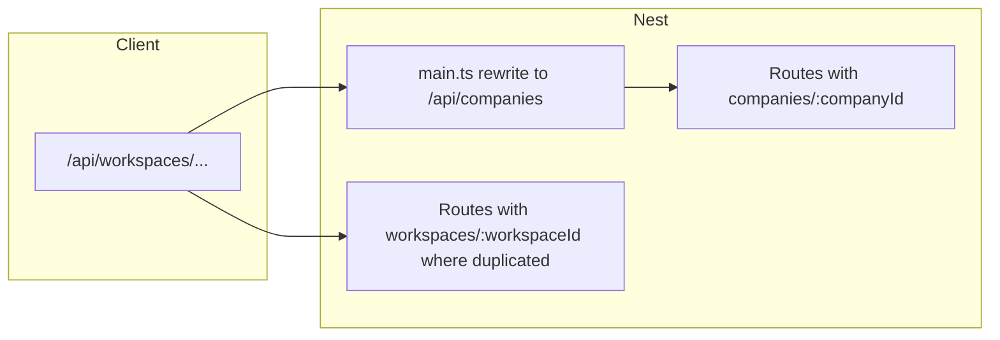

# Company → workspace terminology migration (full plan)

## Current state (baseline)

- **HTTP:** The SPA and most clients already call **`/api/workspaces/...`**. [`server-nest/src/main.ts`](hypowork/server-nest/src/main.ts) middleware rewrites **`/api/workspaces` → `/api/companies`** before routing, so most Nest handlers still match paths declared with **`companies/:companyId/...`**.
- **Dual registration:** [`CompaniesController`](hypowork/server-nest/src/companies/companies.controller.ts) uses `@Controller("companies")`; [`WorkspacesController`](hypowork/server-nest/src/workspaces/workspaces.controller.ts) **extends** it with `@Controller("workspaces")` — same handlers registered under both prefixes (see [`app.module.ts`](hypowork/server-nest/src/app.module.ts) imports). Together with the rewrite, behavior is redundant but **backward-compatible**.
- **Many controllers** use `@Controller()` and **fully qualified** paths such as `companies/:companyId/documents/...` (e.g. [`documents.controller.ts`](hypowork/server-nest/src/documents/documents.controller.ts)). A few routes also declare **`workspaces/:workspaceId/...`** duplicates in some modules (e.g. [`document-import`](hypowork/server-nest/src/document-import/document-import.controller.ts), [`access`](hypowork/server-nest/src/access/access.controller.ts), [`agents`](hypowork/server-nest/src/agents/agents.controller.ts), [`projects`](hypowork/server-nest/src/projects/projects.controller.ts), [`llms`](hypowork/server-nest/src/llms/llms.controller.ts)).
- **Semantics:** `companyId` / `workspaceId` in params are the same FK: **`workspaces.id`** (see [`documents-collections.md`](hypowork/docs/design/documents-collections.md) naming section).
- **Shared / types:** [`packages/shared`](hypowork/packages/shared/src) still exports many **`Company*`** types and **`companyId`** fields (grep shows broad usage across `types/` and `validators/`).

## Migration principles (non-negotiable)

1. **One vertical slice at a time** — finish types + server + client for a domain before the next.
2. **Preserve HTTP contracts** until a deliberate “flip” phase: either keep **dual routes** or **middleware rewrites** so old integrations do not break mid-migration.
3. **Rename identifiers in this order:** public docs/UX strings → **TypeScript types (aliases)** → **service function names** → **Nest param names** → **route path segments** → (optional) **DB column names**.
4. **Every phase ends with:** `pnpm` typecheck for `@paperclipai/server`, `@hypowork/server-nest`, and affected client packages; smoke test critical flows (login, workspace list, issues, documents, agents).

## Phase ranking (P0 highest — do first)

| Phase | Goal | Risk | Rollback |
|-------|------|------|----------|
| **P0** | Governance: glossary, deprecation policy, “done” criteria | Low | N/A |
| **P1** | Shared package: **`Workspace*` aliases + `@deprecated` on `Company*`**; re-exports from one place | Low | Remove exports |
| **P2** | Server services (`@paperclipai/server`): rename **`companyId` params** in *new* APIs only, or add parallel `workspaceId` wrappers; **do not** rename `companyService` file in P2 unless you accept a huge diff | Medium | Git revert |
| **P3** | Nest: **`@Param("workspaceId")`** + path segments **`workspaces/:workspaceId`** per module; keep **`companies/:companyId` mirrors** OR invert middleware (`companies` → `workspaces`) | Medium–High | Keep dual routes |
| **P4** | Client: rename `companyId` variables to `workspaceId`; types from P1 | Medium | Mechanical |
| **P5** | Docs/skills/OpenAPI: replace user-facing “company” | Low | Docs only |
| **P6** (optional) | DB: rename remaining `company_id` / `workspace_id` inconsistencies in Drizzle (migrations) | High | Migrations |

## P0 — Governance (checklist)

- [ ] Add a short **glossary** to [`docs/design/`](hypowork/docs/design/) or extend [`documents-collections.md`](hypowork/docs/design/documents-collections.md): *workspace id*, *workspace document*, *deprecated: company* in code.
- [ ] Define **HTTP compatibility window**: e.g. “`/api/companies` supported until v2” or “forever via rewrite.”
- [ ] Add a **tracking issue** with this checklist attached.

## P1 — `packages/shared` (checklist)

- [ ] For each exported type in [`types/company.ts`](hypowork/packages/shared/src/types/company.ts) (and related), add **`export type WorkspaceX = CompanyX`** (or rename + alias old name) and mark `CompanyX` **@deprecated** with JSDoc pointing to `WorkspaceX`.
- [ ] Same for validators: [`validators/company.ts`](hypowork/packages/shared/src/validators/company.ts) → `workspace.ts` re-exports or aliases.
- [ ] [`validators/company-documents.ts`](hypowork/packages/shared/src/validators/company-documents.ts) → `workspace-documents.ts` pattern (file can re-export old name).
- [ ] Update [`packages/shared/src/index.ts`](hypowork/packages/shared/src/index.ts) to export both names; run downstream typecheck.

## P2 — `@paperclipai/server` services (incremental checklist)

Prefer **small PRs** by service file, not one mega-rename.

- [ ] [`services/companies.ts`](hypowork/server/src/services/companies.ts) — document whether `companyService` becomes `workspaceService` (optional rename in P3 after call sites mapped).
- [ ] [`services/documents.ts`](hypowork/server/src/services/documents.ts) — rename `companyId` in **public** method inputs to `workspaceId` **or** add typed aliases; keep DB queries unchanged.
- [ ] Repeat for other services that take `companyId` in user-facing APIs: agents, issues, costs, activity, access, etc. (grep `companyId` in [`hypowork/server/src/services`](hypowork/server/src/services)).

## P3 — Nest routes and decorators (full module checklist)

**Strategy for each file:** (a) Add **`workspaces/:workspaceId/...`** route strings **alongside** existing `companies/:companyId/...` **OR** (b) replace segment and **invert** [`main.ts`](hypowork/server-nest/src/main.ts) rewrite to `companies` → `workspaces` for old clients. (a) is safer for incremental migration; (b) fewer duplicate decorators.

**Param naming:** use `@Param("workspaceId") workspaceId: string` and pass to services; keep internal variable names consistent.

| Priority | Module / file | Notes | Est. `companies/:companyId` hits (from grep) |
|----------|----------------|-------|-----------------------------------------------|
| 1 | [`companies/companies.controller.ts`](hypowork/server-nest/src/companies/companies.controller.ts) | Core workspace CRUD; already has [`workspaces.controller.ts`](hypowork/server-nest/src/workspaces/workspaces.controller.ts) extending — decide single source of truth | Uses `:companyId` on `companies` |
| 2 | [`issues/issues.controller.ts`](hypowork/server-nest/src/issues/issues.controller.ts) | Mixed `issues/...` and `companies/:companyId/...` | 5 |
| 3 | [`documents/documents.controller.ts`](hypowork/server-nest/src/documents/documents.controller.ts) | High traffic | 11 |
| 4 | [`agents/agents.controller.ts`](hypowork/server-nest/src/agents/agents.controller.ts) | 9 + partial `workspaces` already | 9 |
| 5 | [`costs/costs.controller.ts`](hypowork/server-nest/src/costs/costs.controller.ts) | 13 | 13 |
| 6 | [`vault/vault.controller.ts`](hypowork/server-nest/src/vault/vault.controller.ts) | 14 | 14 |
| 7 | [`chat/chat.controller.ts`](hypowork/server-nest/src/chat/chat.controller.ts) | 10 | 10 |
| 8 | [`memory/memory.controller.ts`](hypowork/server-nest/src/memory/memory.controller.ts) | 8 | 8 |
| 9 | [`skills/skills.controller.ts`](hypowork/server-nest/src/skills/skills.controller.ts) | 8 | 8 |
| 10 | [`learner/learner.controller.ts`](hypowork/server-nest/src/learner/learner.controller.ts) | 7 | 7 |
| 11 | [`access/access.controller.ts`](hypowork/server-nest/src/access/access.controller.ts) | Mixed `workspaces` + `companies` | 6 |
| 12 | [`document-mode/document-mode.controller.ts`](hypowork/server-nest/src/document-mode/document-mode.controller.ts) | 8 | 8 |
| 13 | [`notes-viewer/notes-viewer.controller.ts`](hypowork/server-nest/src/notes-viewer/notes-viewer.controller.ts) | 5 | 5 |
| 14 | [`prompt-learning/prompt-learning.controller.ts`](hypowork/server-nest/src/prompt-learning/prompt-learning.controller.ts) | 3 | 3 |
| 15 | [`secrets/secrets.controller.ts`](hypowork/server-nest/src/secrets/secrets.controller.ts) | 3 | 3 |
| 16 | [`projects/projects.controller.ts`](hypowork/server-nest/src/projects/projects.controller.ts) | Dual patterns | 2 |
| 17 | [`goals/goals.controller.ts`](hypowork/server-nest/src/goals/goals.controller.ts) | 2 | 2 |
| 18 | [`canvases/canvases.controller.ts`](hypowork/server-nest/src/canvases/canvases.controller.ts) | 2 | 2 |
| 19 | [`assets/assets.controller.ts`](hypowork/server-nest/src/assets/assets.controller.ts) | 2 | 2 |
| 20 | [`activity/activity.controller.ts`](hypowork/server-nest/src/activity/activity.controller.ts) | 2 | 2 |
| 21 | [`approvals/approvals.controller.ts`](hypowork/server-nest/src/approvals/approvals.controller.ts) | 2 | 2 |
| 22 | [`document-import/document-import.controller.ts`](hypowork/server-nest/src/document-import/document-import.controller.ts) | Already has `workspaces` routes | 2 |
| 23 | [`dashboard/dashboard.controller.ts`](hypowork/server-nest/src/dashboard/dashboard.controller.ts) | 1 | 1 |
| 24 | [`sidebar-badges/sidebar-badges.controller.ts`](hypowork/server-nest/src/sidebar-badges/sidebar-badges.controller.ts) | 1 | 1 |
| 25 | [`software-factory/software-factory.controller.ts`](hypowork/server-nest/src/software-factory/software-factory.controller.ts) | 1 | 1 |
| 26 | [`plc/plc.controller.ts`](hypowork/server-nest/src/plc/plc.controller.ts) | 1 | 1 |
| 27 | [`execution-workspaces/execution-workspaces.controller.ts`](hypowork/server-nest/src/execution-workspaces/execution-workspaces.controller.ts) | 1 | 1 |
| 28 | [`editor-ai/editor-ai.controller.ts`](hypowork/server-nest/src/editor-ai/editor-ai.controller.ts) | 1 | 1 |
| 29 | [`llms/llms.controller.ts`](hypowork/server-nest/src/llms/llms.controller.ts) | Uses `workspaces` | 2 (pattern) |

**After all handlers migrated:**

- [ ] Update [`main.ts`](hypowork/server-nest/src/main.ts) rewrite direction or remove if redundant.
- [ ] Re-evaluate `WorkspacesController extends CompaniesController` — may collapse to one `@Controller("workspaces")` with legacy shim.

## P4 — Client ([`hypowork/client/src/api`](hypowork/client/src/api))

- [ ] Rename parameters `companyId` → `workspaceId` in API helpers (behavior unchanged).
- [ ] Switch imported types from `CompanyDocument` → `WorkspaceDocument` once P1 exports exist.
- [ ] Grep [`hypowork/client/src`](hypowork/client/src) for `companyId`, `Company`, and update UI copy.

## P5 — External surfaces

- [ ] [`hypowork/docs/api`](hypowork/docs/api) and [`hypowork/skills`](hypowork/skills) — replace “company” in examples where it means workspace.
- [ ] Agent-facing docs ([`docs/guides/agent-developer`](hypowork/docs/guides/agent-developer)) — optional path examples `/api/workspaces/{workspaceId}/...` only.

## P6 — Database (optional, separate project)

- [ ] Audit Drizzle schema: columns mapped as `companyId` but DB is `workspace_id` — document-only vs migration.
- [ ] Only run migrations when downtime/backup story is clear; coordinate with any external reporting.

## Suggested migration order (one PR per row)

1. P0 glossary + P1 shared aliases (no runtime behavior change).
2. `documents` + `issues` Nest paths + services (highest user impact).
3. `agents`, `costs`, `vault`, `chat`.
4. Remaining controllers by table above.
5. `main.ts` + `CompaniesController` consolidation.
6. P4 client rename.
7. P5 docs; P6 DB only if needed.

## Testing gates (each PR)

- `pnpm --filter @paperclipai/server run build` and `pnpm --filter @hypowork/server-nest run typecheck`.
- Manual: workspace list, issue open, document open/save, agent heartbeat invoke (if applicable).
