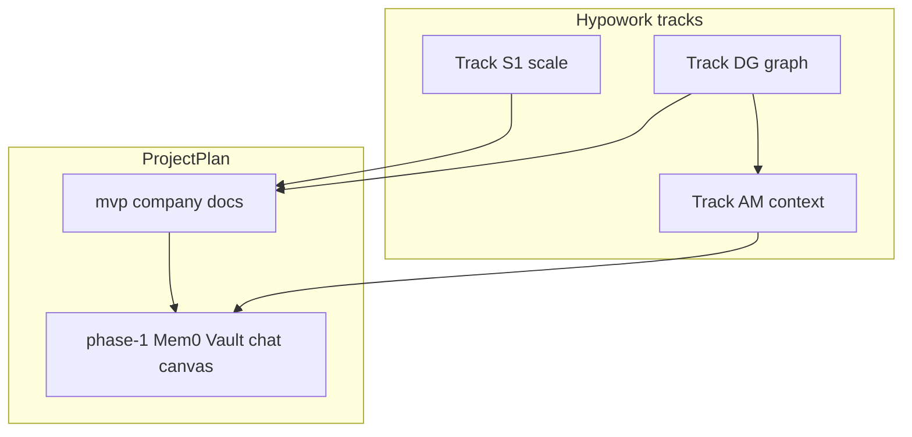
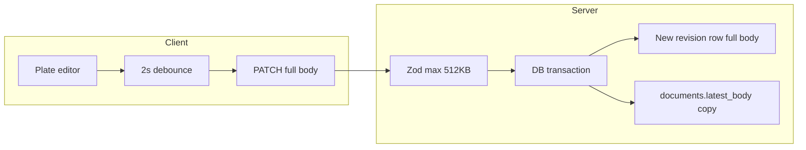
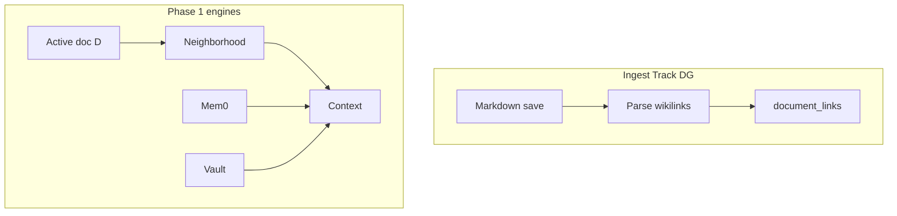

# Hypowork: company documents — scale, graph, and Mem0/Vault alignment

**Purpose:** Engineering backlog for **hypowork** (Nest + Plate company documents): autosave **scale** (Tracks **S1–S3**), **document graph** (**Track DG** — Obsidian-style `[[wikilink]]` + `@` links, outlinks/inlinks), and **agentic context** (**Track AM** — link neighborhood feeding **Mem0 + Vault**).

**Roadmap source of truth:** [MASTER_PLAN.md](MASTER_PLAN.md), [mvp.md](mvp.md), [phase-1.md](phase-1.md) (especially §1.3, §1.6, §1.7).

**Related:** [report.md](report.md) — autosave pattern comparison (plate-main, hypowork, arscontexta-grok, Hypopedia).

**Naming:** Tracks **S1–S3 / DG / AM** in this doc are **not** the same as ProjectPlan **phase** numbers — do not confuse **Track DG/AM** with [phase-4.md](phase-4.md) (Self-improvement).

---

## How this plan ties to ProjectPlan

| This document (hypowork tracks) | ProjectPlan anchor | What to build / prove |
| ------------------------------- | ------------------ | --------------------- |
| **Track S1–S3** (scale) | [mvp.md](mvp.md) notes/plans, [phase-0.md](phase-0.md) Nest | Reliable **documents API** and editor autosave under load; optional CRDT later. |
| **Track DG** (document graph) | [mvp.md](mvp.md) shared notes; [phase-1.md](phase-1.md) §1.7, §1.3 link-neighborhood RAG | `[[wikilink]]` + `@` → outlinks/inlinks + `document_links` (Hypopedia-style), Plate UX + backlinks. |
| **Track AM** (agentic context) | [phase-1.md](phase-1.md) §1.3 Mem0 + Vault, §1.5, §1.6 | Context = active doc **D** ∪ **1-hop** linked docs → Mem0 → Vault; provenance. |

---

## Current architecture (bottlenecks)

- **Payload:** Full `body` each save ([`updateCompanyDocumentSchema`](../hypowork/packages/shared/src/validators/company-documents.ts) `max(524288)`).
- **Storage:** New revision row + `documents.latest_body` ([`updateCompanyDocument`](../hypowork/server/src/services/documents.ts) ~585–687). Cost **O(saves × body size)**.
- **Concurrency:** `baseRevisionId` must match latest or **409** (no CRDT merge).
- **Client:** Debounced autosave ([`DocumentDetail.tsx`](../hypowork/client/src/pages/DocumentDetail.tsx)).
- **Links:** `document_links` + `GET .../links` and `.../neighborhood` (Track DG — Phase 1 complete; see [docs/phase-1-track-dg.md](../docs/phase-1-track-dg.md)); optional Plate `@` / `[[` autocomplete polish remains backlog.

---

## External research — agentic memory (2025–2026)

- [MAGMA (arXiv:2601.03236)](https://arxiv.org/abs/2601.03236) — multi-graph, policy-guided retrieval.
- [Graph-RAG / agent memory (AAIA)](https://aaia.app/research/graph-rag-agent-memory).
- [Mem0 — agentic RAG](https://mem0.ai/blog/what-is-agentic-rag).
- [neo4j-labs/agent-memory](https://github.com/neo4j-labs/agent-memory).

---

## Reference: Hypopedia (local clone paths)

| Concern | Path |
| ------- | ---- |
| Wikilink regex + import | `Hypopedia/blocksuite/affine/widgets/linked-doc/src/transformers/markdown.ts` |
| Indexer 1-hop neighborhood | `Hypopedia/packages/backend/server/src/plugins/indexer/service.ts` — `getLinkedDocIds` |
| Graph / backlinks | `Hypopedia/packages/frontend/core/src/desktop/pages/workspace/graph-page/doc-graph/services/doc-graph-data.ts` |
| Linked-doc UI | `Hypopedia/blocksuite/affine/widgets/linked-doc` |

Linked doc blocks use `refDocId`. Hypowork equivalent: markdown + `document_links` + neighborhood API.

---

## Track S1 — Near-term scale

| Area | Action |
| ---- | ------ |
| Revision retention | On-save prune: `DOCUMENT_REVISION_RETAIN_LAST` (optional); cold archive TBD for compliance. |
| DB / ops | Monitor `document_revisions` ([schema](../hypowork/packages/db/src/schema/document_revisions.ts)). |
| API | Gzip bodies at proxy; rate limits on PATCH ([`documents.controller.ts`](../hypowork/server-nest/src/documents/documents.controller.ts)). |
| Client | Skip PATCH when body unchanged vs `latestBody`. |
| Observability | PATCH latency, 409 rate, body size, revisions/day. |

## Track S2 — Medium (markdown-first)

- **No-op update:** done for company documents (Track S1) — identical title/body/format skips a new revision.
- Optional **ETag / content-hash** short-circuit on `PATCH` (skip DB read of body when `If-Match` matches stored hash) — not implemented.
- Optional **deltas / canonical block JSON** — defer until payload cost is measured.
- **Blobs + markdown refs:** design below; **storage already exists** for company images/logos via [`assets`](../hypowork/packages/db/src/schema/assets.ts) and Nest [`assets.controller.ts`](../hypowork/server-nest/src/assets/assets.controller.ts).

### S2 design — large binaries in company markdown (reuse `assets`)

**Goal:** Keep `documents.latest_body` and `document_revisions.body` as **markdown text**; store bytes in **object storage** with a **DB row** for metadata, auth, and dedupe (same pattern as issue attachments / company asset uploads).

**What exists today**

| Piece | Location |
| ----- | -------- |
| Table `assets` | `company_id`, `provider`, `object_key`, `content_type`, `byte_size`, `sha256`, optional `original_filename`, actor ids |
| Upload | `POST /api/companies/:companyId/assets/images` (multipart) → returns `assetId`, `contentPath` (e.g. `/api/assets/:id/content`) |
| Content read | `GET /api/assets/:assetId/content` (with existing auth / company rules used elsewhere for assets) |

**Markdown reference syntax (recommended)**

1. **Images in Plate / GFM:** standard `` where `URL` is the **app-relative** path returned by the API, e.g. `/api/assets/{uuid}/content` (or absolute origin in emails/exports). Survives `serializeMd` as normal markdown.
2. **Non-image files:** `[$filename](/api/assets/{uuid}/content)` or explicit link text; avoid embedding base64 in markdown.
3. **Optional stable mnemonic (future):** `asset:{uuid}` in a custom remark plugin for prettier authoring — resolve to content URL at **render** and in **link extractors**; not required if full URL in markdown is acceptable.

**Upload path for “this note” (implementation backlog)**

- Add optional `sourceDocumentId` (nullable FK → `documents.id`, same company) on `assets` **or** store linkage only in activity log / separate `document_assets` join table if many-to-many is needed.
- New or extended endpoint, e.g. `POST .../companies/:companyId/documents/:documentId/assets` with same size/type guards as [`MAX_ATTACHMENT_BYTES`](../hypowork/server/src/attachment-types.ts) and [`isAllowedContentType`](../hypowork/server/src/attachment-types.ts).
- Plate: on paste/drop, call upload API, insert `` with returned `contentPath` (same pattern as issue attachment UX if present).

**Retention / GC**

- If `sourceDocumentId` (or join table): on document delete (already cascades issue links), optionally **orphan-scan** assets with no remaining references (markdown scan or refcount) — batch job; legal hold may disable delete.
- Pruned **revisions** may still reference an asset URL; keep asset until no revision body contains the UUID (expensive) or use **immutable assets** + time-based lifecycle policy.

**Security**

- Every content `GET` must enforce **company + actor** same as today’s asset routes; never public unguessable URLs without auth unless a separate signed-URL feature is added.

**When to implement**

- Turn on when p95 document body size or revision growth crosses an agreed threshold (e.g. >256KB text or frequent image paste), or when Plate media pipeline is productized for company docs.

## Track S3 — Strategic (CRDT) — spike notes

**When to consider:** Two or more humans (or agents) editing the **same** company document **at the same time** and product rejects **last-write-wins** / **409 + reload** ([`updateCompanyDocument`](../hypowork/server/src/services/documents.ts) conflict path). Until then, **S1 debounce + no-op + rate limit** is the intended scale path.

### Problem statement

- Today: full markdown `PATCH` + `baseRevisionId` gives **optimistic concurrency** but **no merge** of concurrent edits.
- CRDT goal: **convergent** edits with **causal** ordering and (for Yjs) **awareness** (cursors, presence).

### Option A — **Yjs** (+ optional Hocuspocus / custom sync server)

| Layer | Notes |
| ----- | ----- |
| **Doc model** | Binary **Y.Doc** updates (typically small deltas). Server stores **append-only update log** per `document_id` + optional periodic **snapshot** for fast join. |
| **Plate bridge** | Must map **Slate/Plate tree** ↔ Yjs types (`Y.XmlElement` / `Y.Array` / `Y.Text`). This is the **main cost**: full-kit Plate (tables, callouts, MDX-like nodes) multiplies edge cases. |
| **Markdown** | CRDT state is **not** markdown-native; **export** to markdown for search, `document_links`, and revision history requires a **serialization pass** (lossy if schema diverges). |
| **Undo** | Yjs undo manager vs Plate history — must be wired so one undo stack feels coherent. |

**Rough effort (order of magnitude):** days–1 week for a **toy** rich-text sync; **several weeks+** for parity with current [`PlateFullKitMarkdownDocumentEditor`](../hypowork/client/src/components/PlateEditor/PlateFullKitMarkdownDocumentEditor.tsx) feature surface.

### Option B — **Automerge**

- Stronger **JSON/tree** merge story; sync protocol and WASM bundle differ from Yjs ecosystem.
- Still need **Plate ↔ Automerge** mapping and **transport**; fewer off-the-shelf Plate bindings than Yjs.

### Server shape (either option)

- New table e.g. `document_sync_updates` (`document_id`, `seq`, `update` bytea/json, `created_at`) or object-storage chunks for large docs.
- **Join:** client sends **vector clock** / sync state; server returns missing updates; snapshot when log > N MB.
- **Auth:** same company + document ACL as `PATCH`; WebSocket or SSE channel per doc.

### Recommendation

1. **Do not start S3** until product confirms **live multiplayer** on company docs (not issues-only).
2. If triggered, **spike Yjs** on a **narrow** Plate surface (e.g. paragraphs + bold only) + one WebSocket route **before** committing to full-kit sync.
3. Keep **markdown + `document_links`** as **derived** from snapshot export until CRDT export is proven stable.

See [phase-1.md](phase-1.md) infinite canvas / chat scope; CRDT is **not** a gate for MVP notes.

## Track DG — Document graph (`[[wikilink]]` + `@`)

- **Syntax:** `[[Title]]`, `[[uuid]]`, `[[Title|alias]]`; `@` for docs first (e.g. `@doc/Title` or `@uuid`).
- **Persistence:** `document_links`; re-parse on `updateCompanyDocument`.
- **API:** `GET .../documents/:id/links`, `.../neighborhood?depth=1`.
- **Client:** Plate `@` + `[[` autocomplete; backlinks panel on [`DocumentDetail`](../hypowork/client/src/pages/DocumentDetail.tsx).

## Track AM — Mem0 + Vault + neighborhood

When chat or agent is scoped to document **D**:

1. **D** + 1-hop linked docs (Track DG) — use **`GET .../documents/:id/context-pack`** for bodies + `role` provenance (hypowork today).
2. **Mem0** recall (Phase 1 engine — not in hypowork yet).
3. **Vault** files / claims (Phase 1 engine — not in hypowork yet).
4. Optional: embeddings / Graph-RAG; **provenance** of injected sources.

**Dependency:** Neighborhood API should land **with** Phase 1 chat RAG ([phase-1.md](phase-1.md) §1.6) so citations can include **linked company docs**.

---

## Recommendation (execution order)

1. **S1** — stability under autosave.
2. **DG** — parallel with early Phase 1 if chat/RAG is starting.
3. **AM** — wire neighborhood into Mem0/Vault context per Phase 1.
4. **S2** — when markdown/blob size hurts.
5. **S3** — only if CRDT multiplayer is required.

---

## Implementation checklist (mirror for issues/PRs)

- [x] **S1:** **Revision retention (on-save):** `DOCUMENT_REVISION_RETAIN_LAST` + optional `DOCUMENT_REVISION_PRUNE_METRICS` ([`documents.ts`](../hypowork/server/src/services/documents.ts) `pruneDocumentRevisionsAfterAppend`); applies to **company standalone** and **issue** document updates. **Cold archival** (export to object storage) still optional / compliance-driven.
- [x] **S1:** Server **no-op update**: identical title (trim-normalized), body, and format → no new revision, no activity log; client already skips debounced save when state matches server ([`DocumentDetail.tsx`](../hypowork/client/src/pages/DocumentDetail.tsx)).
- [x] **S1:** **Compression:** `compression` middleware on Nest ([`main.ts`](../hypowork/server-nest/src/main.ts)) for gzip-compatible responses.
- [x] **S1:** **Rate limit** `PATCH .../documents/:documentId`: **100 requests / 60s** per actor + company + document ([`company-document-patch-throttle.*`](../hypowork/server-nest/src/documents/)); returns **429** when exceeded.
- [x] **S1:** **Metrics hook:** set `DOCUMENT_PATCH_METRICS=1` to log each patch (persisted + body size); see [server-nest/README.md](../hypowork/server-nest/README.md).
- [x] **S2:** Blob + markdown ref **design** (Track S2 § above; reuse `assets` + `/api/assets/:id/content`). **Implementation** (doc-scoped upload, optional `sourceDocumentId` / join table, Plate paste, GC) deferred until size/product drivers.
- [x] **S3:** CRDT **spike notes** (Track S3 § — Yjs vs Automerge, storage sketch, Plate bridge cost, gating). **No code** until multiplayer is a product requirement.
- [x] **DG:** Wikilink + `@` + resolution rules ([`document-link-support.ts`](../hypowork/server/src/services/document-link-support.ts) — `[[title]]`, `@doc/...`, `@uuid`; title match is case-insensitive on standalone company docs).
- [x] **DG:** `document_links` schema + migration [`0039_puzzling_felicia_hardy.sql`](../hypowork/packages/db/src/migrations/0039_puzzling_felicia_hardy.sql); **`GET .../documents/:id/links`**, **`GET .../documents/:id/neighborhood`** (Nest [`documents.controller.ts`](../hypowork/server-nest/src/documents/documents.controller.ts)); links re-indexed on create/update (persist path).
- [x] **DG:** Plate **`@` autocomplete** for other company notes ([`MentionInputElement`](../hypowork/client/src/ui/mention-node.tsx) + [`DocumentLinkPickerContext`](../hypowork/client/src/context/DocumentLinkPickerContext.tsx) on [`DocumentDetail`](../hypowork/client/src/pages/DocumentDetail.tsx)); UUID-keyed mentions serialize to plain **`@uuid`** markdown ([`markdown-kit.tsx`](../hypowork/client/src/plate-markdown/kits/plugins/markdown-kit.tsx)) so `document_links` indexing matches. **`[[` wikilink combobox** ([`wikilink-combobox-kit.tsx`](../hypowork/client/src/plate-markdown/kits/plugins/wikilink-combobox-kit.tsx), [`wikilink-input-node.tsx`](../hypowork/client/src/ui/wikilink-input-node.tsx)) inserts `[[title]]` (titles sanitized to drop `]`).
- [x] **DG:** Backlinks / outlinks panel on [`DocumentDetail`](../hypowork/client/src/pages/DocumentDetail.tsx)
- [x] **AM (partial):** **`GET .../documents/:id/context-pack`** — assembled **center + 1-hop bodies** with **`role`** provenance ([`documents.ts`](../hypowork/server/src/services/documents.ts) `getStandaloneDocumentContextPack`, Nest [`documents.controller.ts`](../hypowork/server-nest/src/documents/documents.controller.ts), client [`documents.ts`](../hypowork/client/src/api/documents.ts)). **Mem0 + Vault injection** into chat/agent runtime still Phase 1 engine work ([phase-1.md](phase-1.md) §1.3).

---

## What’s next

1. **Execute Track S1** in hypowork while **starting Phase 1** orchestration (§1.1–1.2) in parallel — S1 does not block Phase 1 kickoff.
2. **Prioritize Track DG** before or alongside **§1.6 chat RAG** so citations can use **linked company documents**, not only Vault paths.
3. **Track AM:** wire **`GET .../context-pack`** (and later Mem0/Vault) into the chat/agent pipeline ([phase-1.md](phase-1.md) §1.3 / §1.6); provenance fields are already on pack items.
4. **Update [report.md](report.md)** when DG syntax and APIs are fixed (add “hypowork document graph” subsection).
5. **Phase 2/3 Factory chat** ([phase-2.md](phase-2.md), [phase-3.md](phase-3.md)): reuse the same **company doc graph + Vault** pattern for project-scoped RAG where Factory artifacts link back to org notes.

When this checklist is largely done for MVP + Phase 1 scope, treat **S2/S3** as driven by measured pain (payload size, concurrent editing), not as gates for Phase 2 Software Factory.
