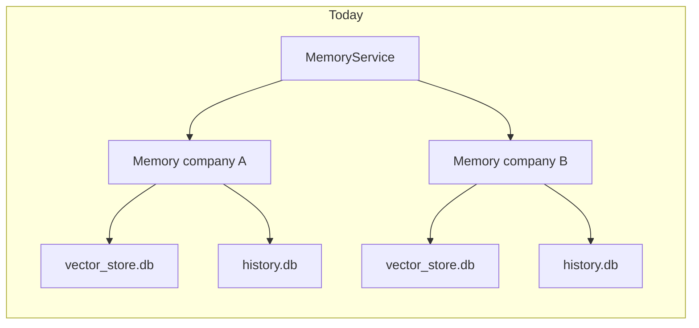
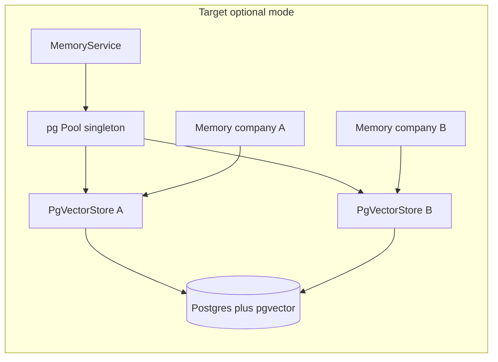

# Mem0 storage refactor for Postgres/pgvector upgrade

## Current state

- [`packages/mem0/src/utils/factory.ts`](hypowork/packages/mem0/src/utils/factory.ts) only registers `memory` (SQLite vectors via [`MemoryVectorStore`](hypowork/packages/mem0/src/vector_stores/memory.ts)) and `sqlite` history ([`SQLiteManager`](hypowork/packages/mem0/src/storage/sqlite.ts)). Despite comments and deps (`pg` is already in [`packages/mem0/package.json`](hypowork/packages/mem0/package.json)), nothing else is wired.
- [`server-nest/src/memory/memory.service.ts`](hypowork/server-nest/src/memory/memory.service.ts) builds **one `Memory` per `companyId`**, overriding `dbPath` / `historyDbPath` to `.hypowork/mem0/companies/<id>/*.db` (cwd-relative). Isolation is **separate files**, not metadata.
- [`server-nest/src/db/db.module.ts`](hypowork/server-nest/src/db/db.module.ts) already provides a global Drizzle `Db` from `DATABASE_URL` with [`applyPendingMigrations`](hypowork/server-nest/src/db/db.module.ts); Mem0 does not use it today.

## Target state

- **Shared Postgres** (same URL as app) with **pgvector** for embeddings, optional separate history table in the same DB.
- **Logical isolation** by `company_id` on every row (matches current “one store per company” behavior without N connection pools or N physical DBs).
- **Config switch**: e.g. `MEMORY_VECTOR_STORE=memory|pgvector` (and matching history provider), default `memory` so existing installs unchanged.
- **Single `pg.Pool`** (or Drizzle’s underlying client) shared across all per-company `Memory` instances; each instance still passes a **store config closed over `companyId`** so the public `VectorStore` API stays unchanged.

## Implementation plan

### 1. Database schema and migrations (`packages/db`)

- Add Drizzle tables (names TBD, e.g. `mem0_vectors`, `mem0_memory_history`) with:
  - `company_id` (uuid, indexed; matches workspace/company id used today).
  - `id` (text uuid), `payload` (jsonb for Mem0 metadata), `embedding` (`vector(n)` — dimension must match embedder, typically 1536; enforce via config / migration default).
  - Timestamps if useful for debugging; align with what `Memory` exposes on items.
- Ship a SQL migration that runs **`CREATE EXTENSION IF NOT EXISTS vector`** (document that managed Postgres must allow it).
- Add **HNSW** (or IVFFlat) index on `embedding` for cosine / L2 per your chosen distance operator; scope filters remain `WHERE company_id = $1` in queries.
- Register migrations in the same pipeline as existing Hypowork migrations (`applyPendingMigrations`).

### 2. New stores in `@hypowork/mem0`

- **`PgVectorStore`** implementing [`VectorStore`](hypowork/packages/mem0/src/vector_stores/base.ts):
  - Config shape: `{ pool: pg.Pool; companyId: string; dimension: number; table?: string }` (table name matches Drizzle migration).
  - `insert` / `update` / `delete` / `get` / `list`: SQL with `company_id = $n` on all reads/writes.
  - `search`: use pgvector operator (`<=>` for cosine, etc.) + `ORDER BY ... LIMIT` instead of full-table scan (this is the main scalability win vs current SQLite implementation).
  - `deleteCol`: **only delete rows for this `company_id`**, not `DROP TABLE`.
  - `getUserId` / `setUserId`: implement compatibly (e.g. small side table keyed by `company_id`, or no-op with stable synthetic id) so the interface contract is satisfied even if core `Memory` rarely calls these.
- **`PostgresHistoryManager`** implementing [`HistoryManager`](hypowork/packages/mem0/src/storage/base.ts): mirror [`SQLiteManager`](hypowork/packages/mem0/src/storage/sqlite.ts) columns, plus `company_id`, using parameterized SQL via `pool.query`.
- Extend [`VectorStoreFactory`](hypowork/packages/mem0/src/utils/factory.ts) / [`HistoryManagerFactory`](hypowork/packages/mem0/src/utils/factory.ts) with `pgvector` and `postgres` (or a single consistent provider name pair).
- Export new classes from [`packages/mem0/src/index.ts`](hypowork/packages/mem0/src/index.ts) for tests and Nest if needed.
- **Tests**: unit tests with mocked `pool.query` for SQL shape; optional integration test behind env flag if CI has pgvector.

### 3. Nest wiring

- [`ConfigService.memoryConfig`](hypowork/server-nest/src/config/config.service.ts): extend with explicit `vectorStore.provider`, history provider, and `embeddingDims` when pgvector is selected (avoid fragile runtime probe against production DB if possible).
- [`MemoryModule`](hypowork/server-nest/src/memory/memory.module.ts): import [`DbModule`](hypowork/server-nest/src/db/db.module.ts) (or inject `ConfigService` + create a **singleton `pg.Pool`** from `databaseUrl` — prefer one pool for Mem0 only if Drizzle’s driver is awkward for raw vector SQL; avoid duplicate pools if you can share).
- [`MemoryService.getMemoryInstance`](hypowork/server-nest/src/memory/memory.service.ts):
  - If `memory`: keep current behavior (per-company paths under `.hypowork/mem0/...` or absolute paths via env).
  - If `pgvector`: construct `Memory` with `vectorStore: { provider: 'pgvector', config: { pool, companyId, dimension } }` and `historyStore: { provider: 'postgres', config: { pool, companyId, table: ... } }`.
  - **Pool lifecycle**: create pool in module factory, `onModuleDestroy` closes pool.

### 4. Operations and docs

- Update deploy docs ([`hypowork/docs/deploy/environment-variables.md`](hypowork/docs/deploy/environment-variables.md) or memory-specific section): `MEMORY_VECTOR_STORE`, pgvector extension requirement, dimension env, backup/restore now includes Mem0 tables.
- Optional **follow-up** (not blocking): one-off **SQLite → Postgres** migrator for existing `.hypowork/mem0/companies/*/vector_store.db` and `history.db` (read blobs, insert rows with `company_id`).

## Scope boundaries

- **In scope**: refactor + pgvector + Postgres history + env switch + migrations.
- **Out of scope (later)**: Qdrant/Redis factories already hinted in comments — same extension points; separate PR.
- **Risk**: embedding dimension is fixed in the `vector(n)` column; changing embedder model requires migration/alter column — document clearly in config.
