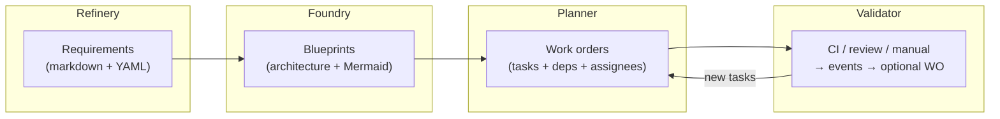

# Software foundry (Phase 2 — Design Factory)

This document describes the **Software Factory** flow in hypowork: **Refinery → Foundry → Planner → Validator**, how each stage relates to product development, and how **authoring + AI assistance** should evolve (full-kit Plate editor, side panel, project-scoped chat).

**Related:** [ProjectPlan/phase-2.md](../../ProjectPlan/phase-2.md) (checklist), migrations `0044_software_factory`, `0045_document_project_canvas` (`documents.project_id`, `projects.planning_canvas_document_id`), API prefix `/api/workspaces/:workspaceId/software-factory/...`, UI: project tab **Design Factory** → `/{prefix}/projects/:projectRef/factory`.

---

## Project shell: **Design Factory** tab

- **User-visible tab name:** **Design Factory** (not “Software factory” in the tab bar — keeps terminology aligned when **hardware** and **hybrid** templates ship in Phase 3).
- **Placement:** Peer tab with **Overview**, **Issues**, **Configuration**, **Budget**; suggested order: Overview → Issues → **Design Factory** → Configuration → Budget.
- **Content:** The tab hosts the full four-stage factory UI (same as today’s `/factory` route). Implementation may keep URL path `factory` or add `design-factory`; **label** is the source of truth for UX copy.
- **Entry:** Use the **Design Factory** tab on the project (URL segment `factory`).

---

## Planner work orders vs **Issues** vs lifecycle **gates**

### Work orders vs **Issues** (board)

| | **Issues** | **Planner work orders** |
|---|------------|-------------------------|
| Role | Board execution: bugs, general tasks, cross-functional work. | Design pipeline: units tied to Refinery/Foundry/Validator, deps, factory assignees. |
| Store | `issues` | `software_factory_work_orders` |

Default: **two systems of record**. Optional **“Track on Issues”**: link a WO to an issue (single link, no duplicate prose) when someone needs inbox/heartbeat/board workflow.

### Work orders vs **PLC-style gates** (kickoff, PDR, CDR, TRR, …)

**Not the same thing:**

- **Gates** are **milestones / decision points** in the project lifecycle: reviews, approvals, go/no-go, often bundling many artifacts and a date.
- **Work orders** are **smaller executable chunks** with status, dependencies, and ownership inside the Design Factory.

**How they relate:** You might create WOs such as “Run PDR review” or “CDR package — mechanical”, use **requirements** for gate exit criteria, and use the **project canvas** (Phase 2 §2.8) for PDR/CDR/TRR as linked nodes. Later, optional **WO `kind`** (e.g. `milestone` / `gate`) can mark lifecycle-heavy items without renaming the Planner model.

---

## End-to-end flow (diagram)

**Intent:** move from *what we need* (Refinery) to *how we build it* (Foundry), *who does what* (Planner), and *what reality says* (Validator), closing the loop back into Planner.

---

## Stages — responsibilities (table)

| Stage | Role | Primary artifacts (data) | Typical author | AI assist (target) |
|-------|------|-------------------------|----------------|-------------------|
| **Refinery** | Clarify and stabilize intent: user stories, constraints, acceptance signals, priorities. | `software_factory_requirements`: `body_md`, optional `structured_yaml`, `version` | PM, engineer, agent | Suggest missing acceptance criteria, detect ambiguity, propose YAML structure, trace conflicts across reqs |
| **Foundry** | Describe architecture: components, boundaries, interfaces, data flow, risks. | `software_factory_blueprints`: `body_md`, `diagram_mermaid`, `linked_requirement_ids` | Tech lead, engineer | Draft blueprint from requirements, suggest Mermaid diagrams, flag gaps vs reqs |
| **Planner** | Break work into executable units: ordering, dependencies, ownership. | `software_factory_work_orders`: `description_md`, `status`, `depends_on_work_order_ids`, assignee fields | Lead, agent | Split epics into WOs, propose deps, summarize blockers, align with Validator output |
| **Validator** | Ingest objective feedback (CI, reviews, incidents) and turn it into follow-ups. | `software_factory_validation_events` + optional spawned work order | CI, reviewer, bot | Classify failures, propose fix WOs, link to blueprint/requirement affected |

---

## UX: document-grade editing + side panel

**Goal:** Factory stages should feel like **serious authoring**, not a form — same **Plate full-kit markdown** stack as company documents (`PlateFullKitMarkdownDocumentEditor`), with a **right-hand assist column** per stage.

| Area | Behavior |
|------|----------|
| **Center** | One Plate editor per selected row for main markdown (`body_md` / `description_md`). Structured fields (YAML, separate Mermaid source) sit below or in the left “add” panel; Foundry shows **live Mermaid preview** next to the diagram field (not a second Plate instance). |
| **Left** | List of artifacts for the current stage; selection drives the editor. |
| **Right (assist)** | Stage-specific guidance, prompts, and links (e.g. open **company chat** to ask questions with factory context). Future: embedded RAG thread scoped to this project’s factory rows. |
| **Autosave** | Debounced PATCH to Nest (same pattern as document autosave). |
| **Planner ports** | `client/src/ports/software-factory-planner.ts` maps `SfWorkOrder[]` → `PlannerKanbanPort` / `PlannerGanttPort` (SSOT for board + timeline). Presenters in `client/src/components/software-factory/PlannerBoardViews.tsx` include **Table** (`PlannerTableFromPort`). **Inside Design Factory → Planner**, use the same **list / board / timeline / table** icon toggle as project **Issues** (persisted in `localStorage` per `companyId`+`projectId`) — similar affordances, **different data** (`SfWorkOrder` vs issues). Gantt bars use `created_at`→`updated_at` until planned dates exist in the schema. |

**Phase 2 activation (roadmap):**

1. Done (baseline): factory CRUD + search + factory page with Plate for main bodies + assist column stub + chat deep link.
2. Next: project-scoped chat threads with RAG over factory tables (see phase-2 §2.7).
3. Next: `@` / `[[wikilink]]` parity with company docs in factory editors (picker context).
4. Done: Mermaid live preview beside Foundry diagram source; Foundry **linked requirements** UI; Planner **status columns** (Kanban-style); project overview **project-scoped notes** + **planning canvas** pointer.
5. Next: Gantt, DnD Kanban, deeper canvas/Vault sync.

---

## API quick reference

| Operation | Method | Path pattern |
|-----------|--------|----------------|
| Global search | GET | `/api/workspaces/:workspaceId/software-factory/search?q=` |
| List / create requirements | GET, POST | `…/projects/:projectId/requirements` |
| Patch / delete requirement | PATCH, DELETE | `…/requirements/:id` |
| List / create blueprints | GET, POST | `…/projects/:projectId/blueprints` |
| Patch / delete blueprint | PATCH, DELETE | `…/blueprints/:id` |
| List / create work orders | GET, POST | `…/projects/:projectId/work-orders` |
| Patch / delete work order | PATCH, DELETE | `…/work-orders/:id` |
| List / create validation events | GET, POST | `…/projects/:projectId/validation-events` |

All routes require the same **board / agent** auth as the rest of the Nest API (`assertWorkspaceAccess`).

---

## Troubleshooting

### `Cannot read properties of undefined (reading 'listRequirements')`

Nest was failing to inject `SoftwareFactoryService` into the controller when running under **`tsx watch`** (missing `design:paramtypes`). **Fix:** explicit `@Inject(SoftwareFactoryService)` on the controller and a `useFactory` provider for `SoftwareFactoryService` in `SoftwareFactoryModule`. Restart the server after pulling the fix.
