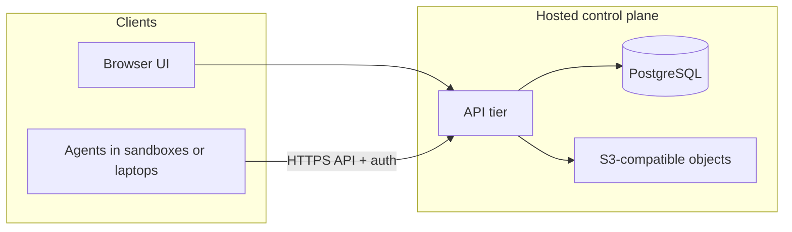

# SaaS architecture — current state and roadmap

This document describes the **current** Hypowork architecture (control plane, data stores, deployment modes) and a **plausible future** shape if the product is operated as **hosted SaaS** (shared infrastructure, many customers, production operations).

It is meant for operators and architects deciding **database**, **object storage**, **filesystem**, and **agent execution** boundaries—not as a committed product roadmap. For canonical deployment modes, see [deployment-modes.md](deployment-modes.md) and [doc/DEPLOYMENT-MODES.md](../../doc/DEPLOYMENT-MODES.md). For stack overview, see [Architecture](../start/architecture.md).

---

## 1. Executive summary

| Concern | Today (typical) | SaaS-shaped future |
|--------|------------------|---------------------|
| **Relational state** | PostgreSQL (embedded local or external URL) | Managed PostgreSQL per environment; backups, HA as required |
| **Issue attachments / asset bytes** | `local_disk` or **S3-compatible** ([storage.md](storage.md)) | **S3-compatible** required for horizontal scale |
| **Per-agent workspace files** (`AGENT_HOME`, PARA, etc.) | **Filesystem** under instance root: `…/workspaces/<agent-id>` | **Durable volume** per instance *or* move execution to **remote sandboxes** so the control plane does not rely on local trees |
| **Auth / exposure** | `local_trusted` \| `authenticated` × (`private` \| `public`) | `authenticated` + `public`; SSO and org policies are product/ops additions |
| **Execution** | Local adapters (e.g. Claude/Codex CLI) on the same host as the server | Same APIs; **remote runtime drivers** (e.g. sandbox, webhook) for cloud-safe execution |

**Bottom line:** The app is already **compatible with managed Postgres + S3** for core product data and attachments. **Per-agent on-disk folders** are the main structural gap for **stateless multi-replica** SaaS unless you **persist a volume**, **pin workloads to one node**, or **shift agent filesystem work off the API host** (roadmap direction in-repo).

---

## 2. Current architecture

### 2.1 Two-layer model

Hypowork intentionally separates:

1. **Control plane** (this application): agents registry, org structure, issues/tasks, costs, heartbeats, APIs, UI.
2. **Execution**: adapters run agent processes or call external runtimes; agents **phone home** to the API.

The control plane does not assume it is the only place agents run; see [GOAL.md](../../doc/GOAL.md).

### 2.2 Request and data flow (simplified)

- **UI:** React (Vite) → REST API.
- **API:** Express (and Nest modules where present) → services → Drizzle/PostgreSQL.
- **Heartbeat:** scheduler invokes **adapters**; adapters set `AGENT_HOME` and `cwd` when spawning local tools.
- **Tenancy:** **Company-scoped** data in the database (strict boundaries in product design); see [Architecture](../start/architecture.md).

### 2.3 Where state lives

| State | Location | Notes |
|-------|----------|--------|
| Companies, agents, issues, auth users, memberships, activity metadata, asset **metadata** | **PostgreSQL** | Single source of truth for control-plane entities |
| Uploaded attachment **bytes** | **local_disk** or **S3** | Configurable; metadata in DB |
| Default **agent workspace** when no project/session workspace applies | **Disk:** `$PAPERCLIP_HOME/instances/<instanceId>/workspaces/<agent-id>` | Resolved at runtime (see `server/src/home-paths.ts`); not stored as file blobs in Postgres |
| Embedded DB files (optional) | **Disk** under instance | Not used when `DATABASE_URL` points to external Postgres |
| Secrets, logs | **Disk** / env | Instance-local |

Operational docs: [database.md](database.md), [storage.md](storage.md), [environment-variables.md](environment-variables.md).

### 2.4 Deployment modes (today)

| Mode | Use case |
|------|----------|
| `local_trusted` | Solo dev; localhost; no login |
| `authenticated` + `private` | Team on VPN/Tailscale/LAN |
| `authenticated` + `public` | Internet-facing host; stricter checks |

See [overview.md](overview.md) and [doc/DEPLOYMENT-MODES.md](../../doc/DEPLOYMENT-MODES.md).

---

## 3. What is already “SaaS-friendly”

- **External PostgreSQL:** Control-plane entities are relational; moving from embedded PG to **cloud Postgres** is a standard migration path.
- **S3-compatible storage:** Attachments can avoid node-local disks for **blob** data—required for **multiple API replicas** serving uploads/downloads consistently.
- **Authenticated public mode:** Matches a hosted product surface (login required, explicit public URL).
- **Adapter model:** Execution can be **out-of-process** or **HTTP**; the API contract does not require agents to run on the API server forever.

---

## 4. Gaps and risks for classic multi-tenant SaaS

These are **architectural/operational** considerations, not a judgment that self-hosted or VM deploys are invalid.

### 4.1 Per-agent filesystem workspaces

On-disk `workspaces/<agent-id>` is ideal for **single-node** or **volume-backed** deploys. For **N stateless replicas** without shared filesystem:

- Each replica could see **different** or **empty** trees → inconsistent agent memory unless **shared storage** (NFS, EFS, etc.) or **single writer** is enforced.
- **Mitigations:** persistent volume mounted at `PAPERCLIP_HOME`; **one replica** for heartbeat execution; or **remote execution** so the control plane does not own the tree (see §5).

### 4.2 Multi-tenant product concerns (product layer)

Hosted SaaS usually adds: **billing**, **SSO**, **org admin**, **data residency**, **rate limits**, **support tooling**. Hypowork’s current docs focus on **instance** deployment, not a full **billing/tenant provisioning** stack—these would be **additional services** or **product features**.

### 4.3 Security and compliance

Public internet deployment requires hardened secrets, TLS, patching, audit logging, and backup/restore drills—standard for any SaaS, beyond what a single doc can prescribe.

---

## 5. Future shape (roadmap-aligned)

Internal planning documents describe making **shared/cloud** paths **first-class** and separating **control plane** from **execution runtime** more explicitly—e.g. runtime drivers such as `local_process`, `remote_sandbox`, `webhook`, with **remote_sandbox** (e2b-style) as a first cloud-oriented driver. Canonical recipes called out include **managed Postgres + object storage + public URL**. See `doc/plans/2026-03-13-features.md` (§5) in the repository.

A **reasonable target picture** for SaaS:

- **DB:** Managed Postgres (HA, backups, migrations in CI).
- **Blobs:** S3-compatible; no attachment bytes on ephemeral disks.
- **Agent file state:** Either **durable volume** for `workspaces/` on execution nodes, **shared file service**, or **remote sandbox** owning the disk—so the **API tier** can stay **stateless**.
- **Execution:** Prefer **remote** or **customer-side** runners for heavy CLI adapters; keep **heartbeat + API** as the stable contract.

---

## 6. Operational checklist (SaaS-shaped deploy)

When moving from “single VM + cloud Postgres” toward **production SaaS posture**, verify:

1. **Postgres:** Managed instance, connection limits, migration job, backup/restore tested.
2. **Storage:** `s3` provider configured; credentials via env/secret manager—not in repo.
3. **Filesystem:** If local adapters run on the server, **mount persistent storage** for `PAPERCLIP_HOME` (or at least `workspaces/` and any embedded paths you still use).
4. **Mode:** `authenticated` + `public`, explicit public base URL, TLS termination.
5. **Scaling:** If more than one API replica, resolve **attachment** and **workspace** story (§4.1).
6. **Observability:** Logs, metrics, alerts on API, DB, and object storage.

---

## 7. References (in-repo)

| Topic | Path |
|-------|------|
| Deployment modes | [overview.md](overview.md), [deployment-modes.md](deployment-modes.md) |
| Database | [database.md](database.md) |
| Object storage | [storage.md](storage.md) |
| Stack & adapters | [Architecture](../start/architecture.md) |
| Vision / control plane vs execution | [GOAL.md](../../doc/GOAL.md) |
| Local dev paths (`workspaces`, storage) | [DEVELOPING.md](../../doc/DEVELOPING.md) |
| Storage implementation plan (metadata vs bytes) | [doc/plans/2026-02-20-storage-system-implementation.md](../../doc/plans/2026-02-20-storage-system-implementation.md) |
| Documents: collections (virtual grouping), metadata & permission layers | [documents-collections.md](../design/documents-collections.md) |

---

## 8. Document maintenance

Update this file when:

- Default storage or workspace resolution changes materially.
- Official SaaS or multi-tenant hosting guidance is added elsewhere (link from here).
- Remote runtime / sandbox execution ships and becomes the recommended cloud path.
