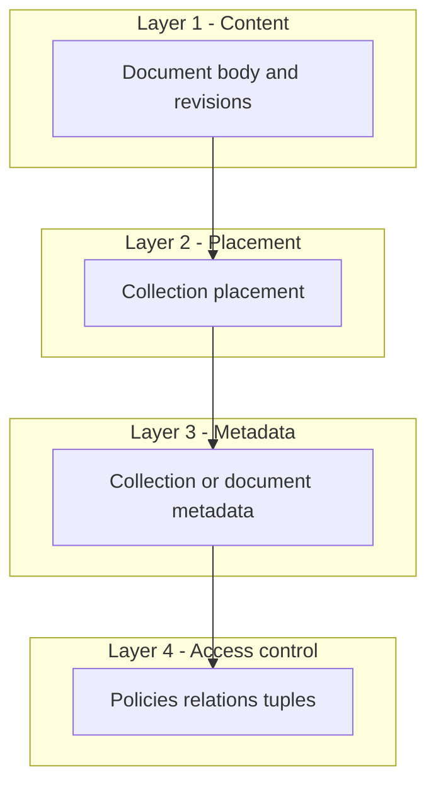

# Documents — collections, metadata, and permission layers

## Vocabulary

| Term | Meaning |
|------|--------|
| **Collection** | A **virtual** grouping for standalone workspace documents: not a filesystem directory on the server, not an OS folder. It is how users **organize and navigate** notes in the product. |
| **Placement** | Where a document lives in that virtual tree. Today stored as a **single string path** (`folder_path` / API `folderPath`) for simplicity and import parity (e.g. Obsidian vault paths). |
| **Document** | The revisioned content row; stable `id`; may sit in **root** (no placement) or under a placement path. |

**Product language:** Prefer **collection** in UI copy and new APIs. **Implementation today** still uses the column name `folder_path` and field `folderPath`—treat that as the **serialized placement key** for a collection path until a migration introduces explicit collection rows.

## Why “collection” instead of “folder”

- **Folder** suggests a disk path or file manager mental model; support and permissions get confused with OS ACLs.
- **Collection** matches common SaaS/doc products and reads naturally for **grouping + sharing + policy** later (collection-scoped access, inherited rules).
- Keeps room for **non-hierarchical** collections later (smart collections, tags-as-views) without renaming again—*if* you add those, model them as separate concepts or views over the same resource graph.

## Layered architecture (scale as you go)

Design so each layer can ship independently; upper layers **depend on stable resource identity** below, not on string paths as the source of truth for authorization.

| Layer | Responsibility | Today (hypowork) | Next steps |
|-------|----------------|------------------|------------|
| **1 — Content** | Markdown/canvas, revisions, links | `documents` + `document_revisions` | Unchanged |
| **2 — Placement** | Virtual tree / grouping for list UX | `documents.folder_path` string; import sets path from ZIP | Introduce `collections` table + `documents.collection_id` (nullable); keep or derive path string for search/display |
| **3 — Metadata** | Title overrides, icons, sort order, archive flags, custom fields | Mostly on document row | `collection_metadata` JSONB or table keyed by `collection_id`; document-level meta as needed |
| **4 — Access control** | Who can read/write/move | Workspace-level gate (`assertWorkspaceAccess`) | Grant/deny on **resource id**: `workspace`, `collection`, `document`. Do **not** key ACLs only on path strings |

## Permission scalability (industry-aligned)

- **Authorize on stable ids:** `collection:<uuid>`, `document:<uuid>`, under `workspace:<uuid>`.
- **Paths are derived:** Moving a document updates **placement** (`collection_id` and/or materialized path cache), not “the permission object.”
- **Optional inheritance:** e.g. “viewer on collection ⇒ viewer on documents in that collection” implemented in a policy engine or tuple store (Zanzibar-style, Cedar, OPA, etc.)—pick when you need sharing matrices, not on day one.

## API evolution (non-breaking mindset)

1. **Shipped:** `collectionPath` on create/patch = placement string; `folderPath` remains accepted. If both are sent, **`collectionPath` wins**. List/get/graph responses include **both** keys with the same value (mirror) for older clients.
2. **Later:** Add `collectionId` when `collections` exists; accept either `collectionId` or path fields during migration; prefer `collectionId` in new clients.
3. **Eventually:** Deprecate path-only writes; resolve path → id on write for backward compatibility.

## Import and ZIP

Import continues to compute a **placement string** from archive paths; that string maps to **collection placement** conceptually. After `collections` exists, import can **ensure** collection rows exist (or lazy-create on first import) and set `collection_id` on created documents.

## Project-scoped list vs workspace-wide list (`GET .../documents`)

- **No `projectId` query param:** Returns **standalone** workspace documents only (rows in `documents` with no `issue_documents` link). This is the library / company-wide note list.
- **`?projectId=<uuid>`:** Returns **standalone** notes with `documents.project_id` = project **union** documents that are **issue-linked** whose **issue** has `issues.project_id` = project. For issue-linked rows, membership follows the **issue’s project**, not `documents.project_id`, so moving the issue moves visibility on the project overview without syncing document placement.

## Open and save (`GET` / `PATCH .../documents/:documentId`)

`GET` and `PATCH` for a document id apply to **any** row in `documents` for that workspace (standalone **or** issue-linked). Issue-created docs use the same revision and body storage as workspace-created notes; the only difference is the extra `issue_documents` link for keyed issue artifacts.

## Workspace document graph (`GET .../documents/graph`)

Graph nodes include **every** document in the workspace (standalone and issue-linked). Edges come from `document_links` where the target is non-null. Historical name `getStandaloneCompanyDocumentGraph` reflects older behavior when issue-linked docs were excluded; the product surface is the full workspace document graph.

## Naming: “company” vs workspace

REST paths still use **`/api/companies/:companyId`** in many places for backward compatibility; the client often calls **`/api/workspaces/:workspaceId`** aliases. **`companyId` in code is the workspace id** (`workspaces.id`). Prefer **workspace document** in new docs and UI copy; **company document** / `CompanyDocument` types are legacy naming in shared packages until a coordinated rename.

## Related

- Issue-linked documents (different product surface): [../plans/2026-03-13-issue-documents-plan.md](../plans/2026-03-13-issue-documents-plan.md)
- SaaS / tenancy context: [../deploy/saas-architecture-current-and-roadmap.md](../deploy/saas-architecture-current-and-roadmap.md)

---

**Maintenance:** Update when `collections` (or equivalent) ships, when ACL model is chosen, or when public API field names change.
